# Assured assessment: Graphical analysis

Analysing DAGs generated by domain experts, along with details of the modelling protocol for eliciting knowledge from domain experts with the use of causal diagrams.

## Modelling Protocol and support materials

The **[modelling protocol]** is in the file `Collaborative Causal Modelling protocol.pdf` in this repo - but it does include questions / components for this particular piece of research in addition to the guidelines for running causal modelling sessions with domain experts. 
There is `dag-dialogue-prompts.pdf` that offer suggestions for the facilitator based on sub-graphs in the current graphical model.

## DAG analysis and results

All analysis in the .qmd file `elicited-DAG-analysis.qmd` however there is a viewable pdf render `elicited-DAG-analysis.pdf`. 
The analysis is broken into four sections: importing the data, a series of causal graph analysis functions, a series of visualisations, and finally an inverse approach where we simulate what a structure learning algorithm might achieve with data relevant to the elicited models. 

There is a lot more here than what might be deemed necessary (exploration was happening), so the key exploration plots are included below.

Paper to come :)

# Visualisations of the 8 models

## Original models 
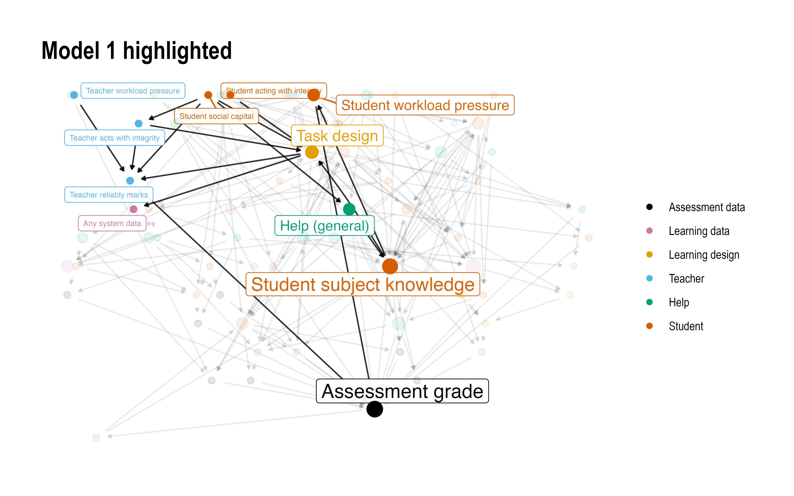
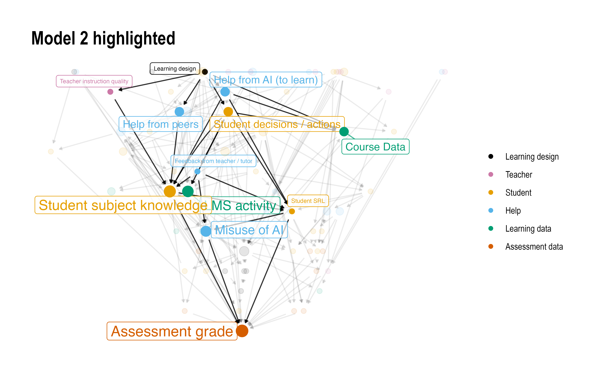
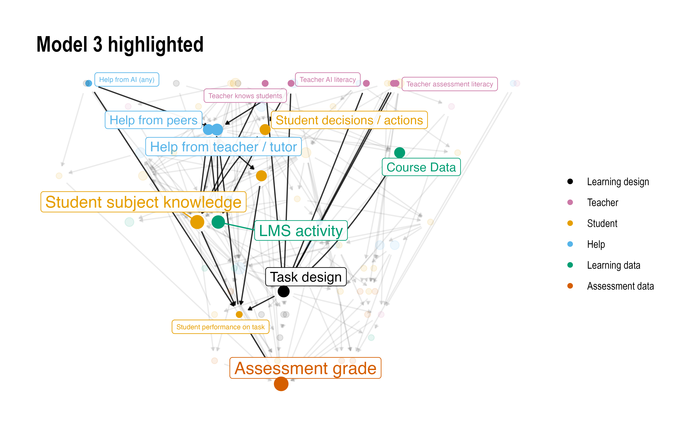
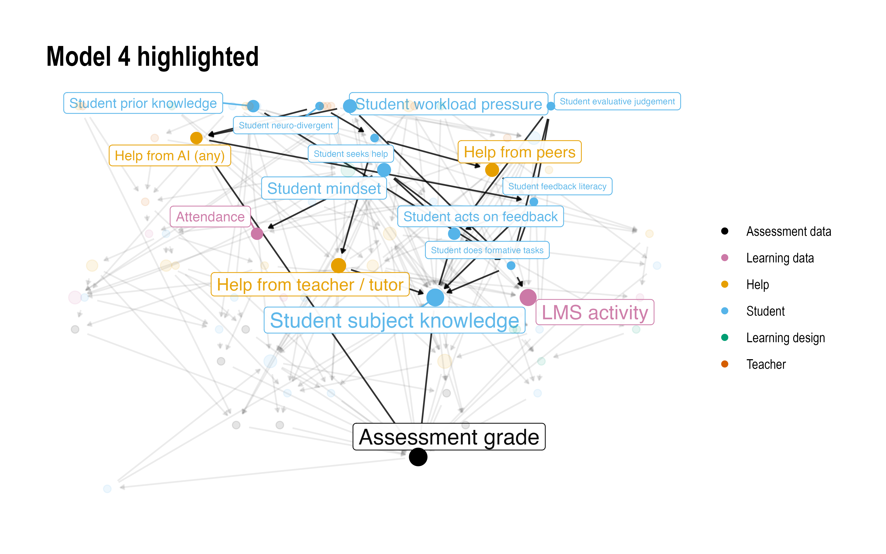
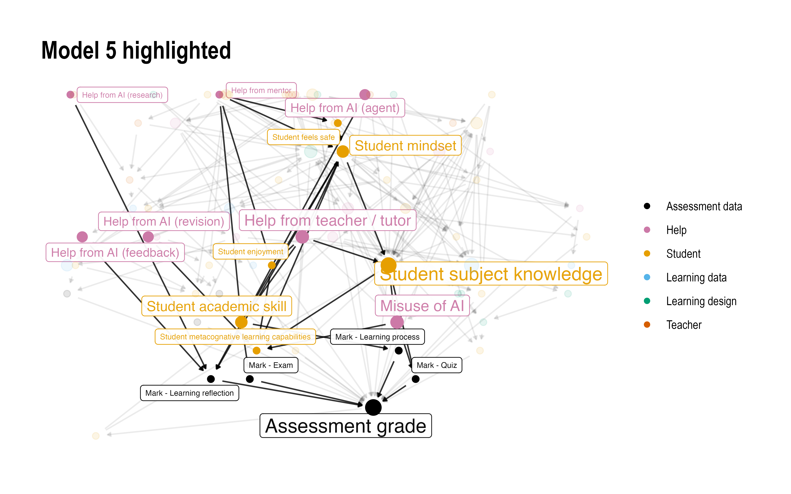
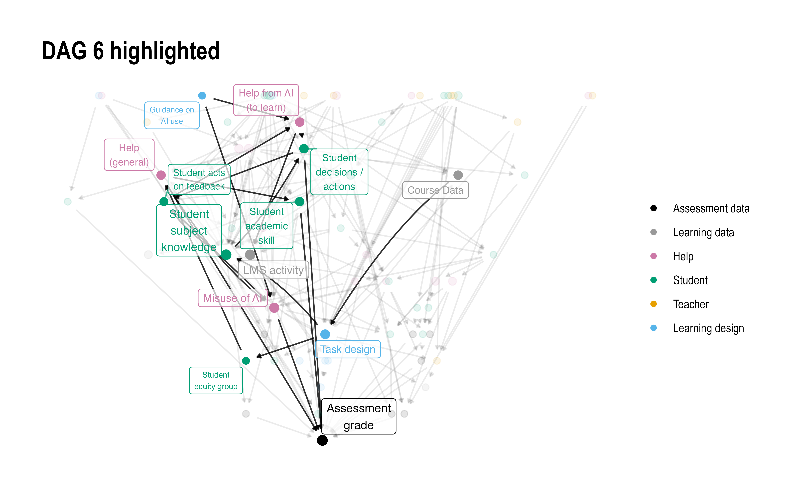
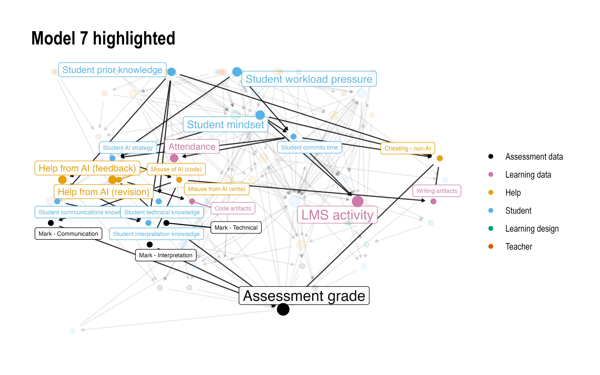
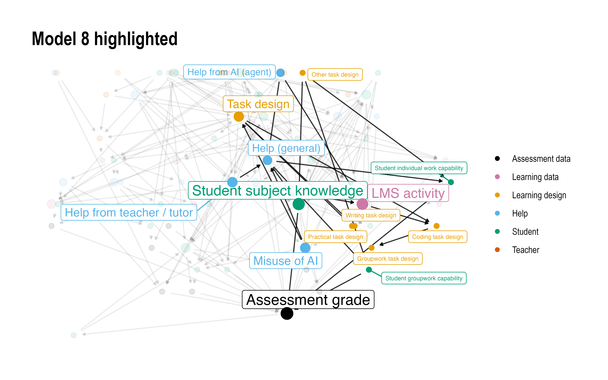

## Coarsened models
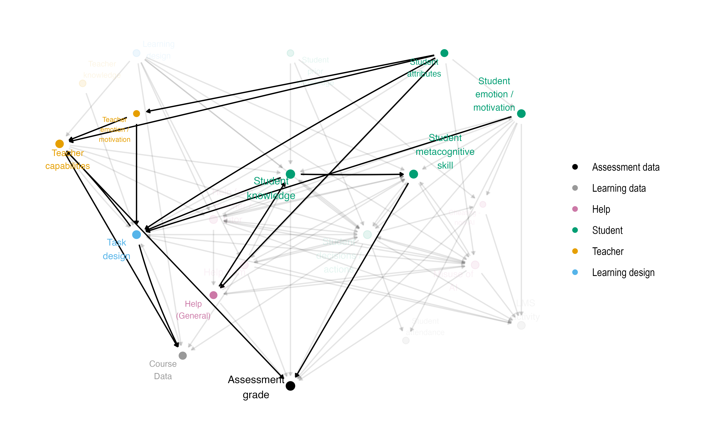
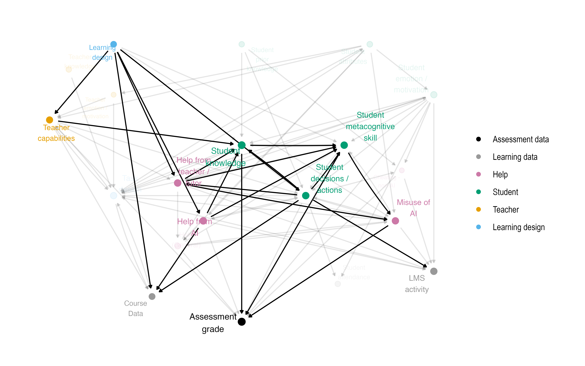
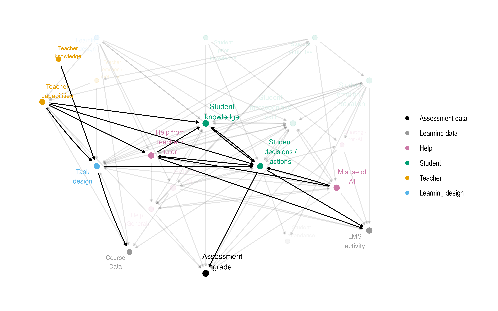
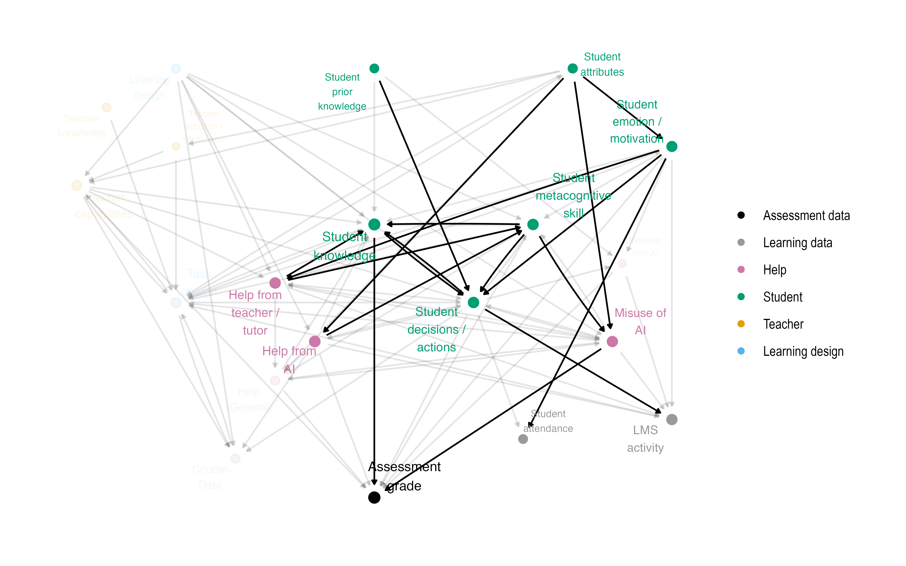
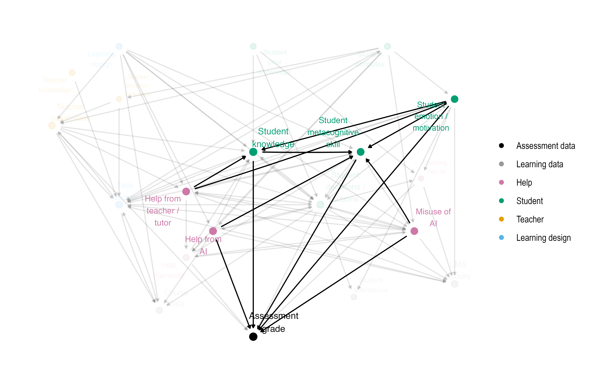
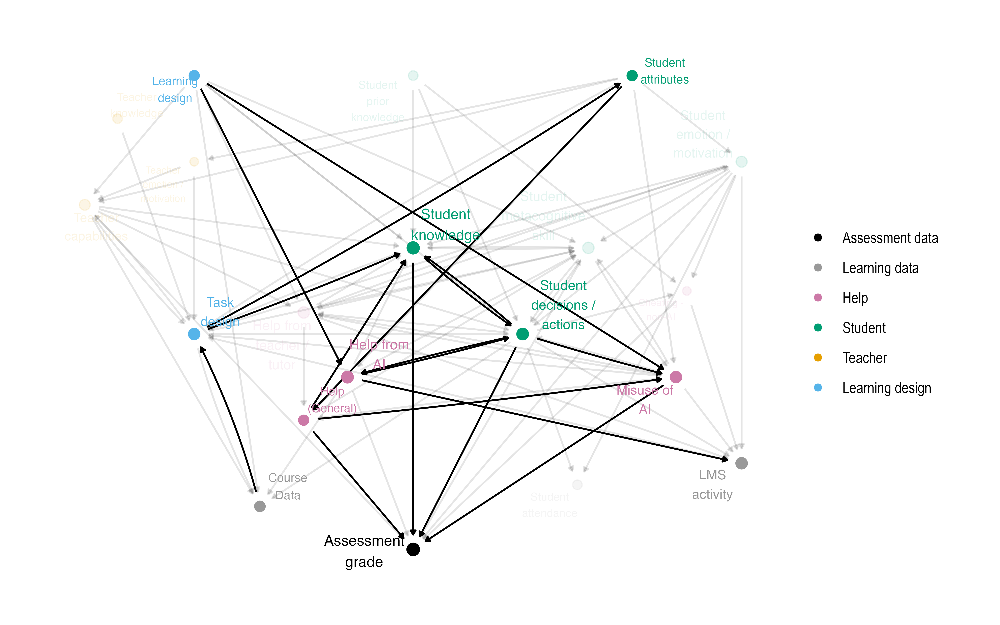
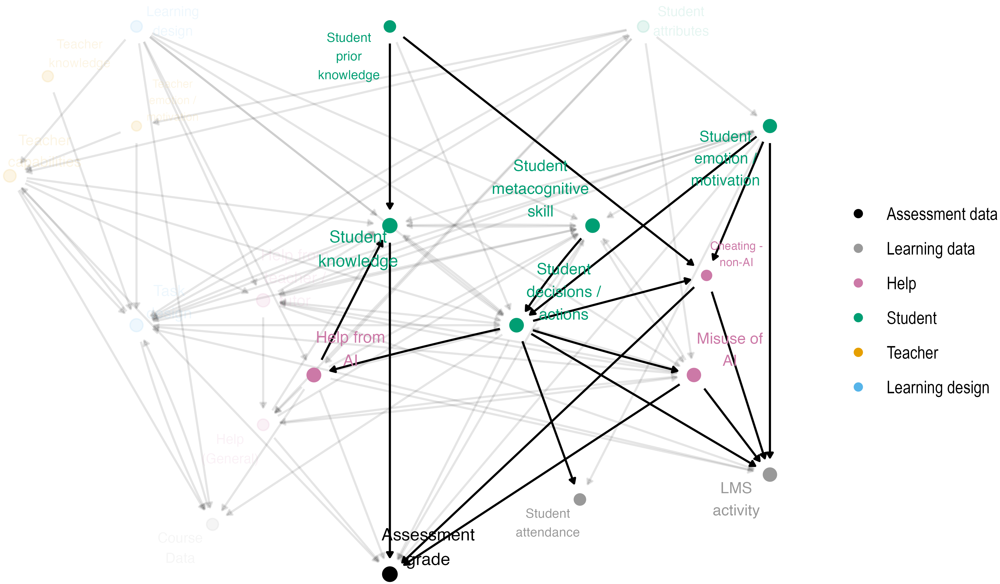
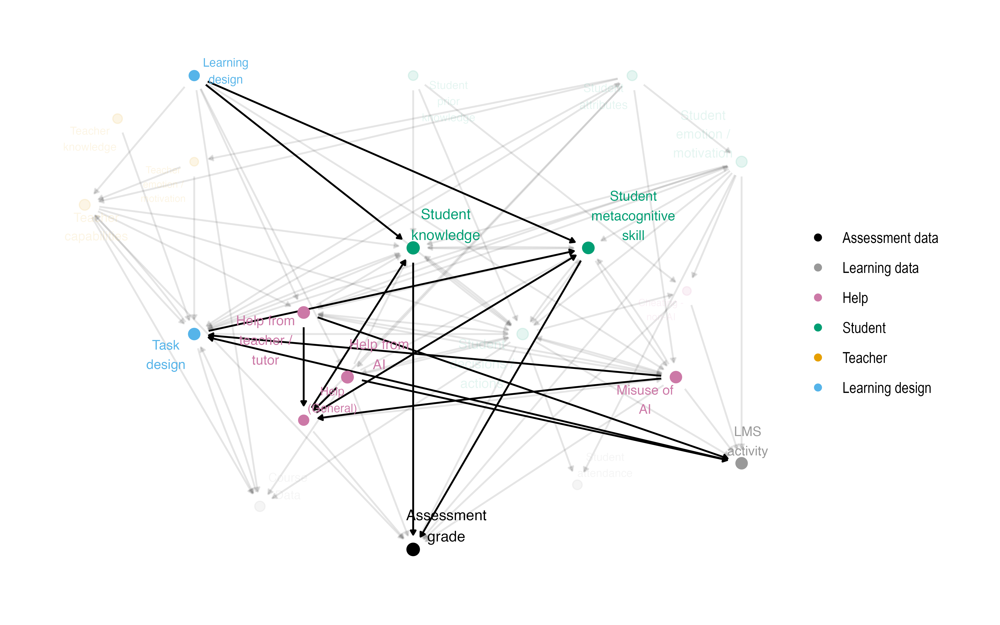
