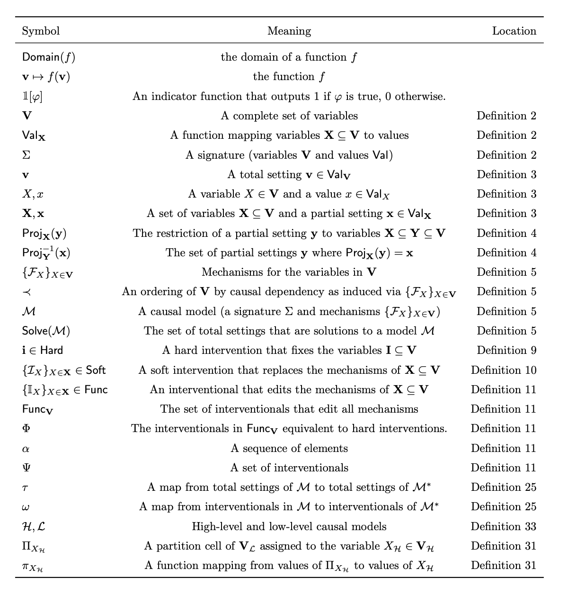

# Overview

### Render settings

```{r rendering-preferences}
# Set to true if L metrics
recalculate_distance_matrices <- FALSE
rerun_simulations <- FALSE
export_and_save_every_model <- FALSE
```

# TODO

## Check new L-dissimilarities are used in vignette 

## Check new definitions throughout:

- L-diss is L0+L1+L2
- Clust method = average
- CHange language to projections in notation and definitions
- Check references for projection validity of L1, L2 theorems.
- Check degradation algorithm actually matches new definition of checking for no contradictions or whatever it was I changed it to


## Change L2 cluster degradation to use optimal adjustment set as well

- Also, generally check the coarsening degradation aligns well enough
  with the consistency

## Vignette on causal degradation?

```{r}
#| include: false
# Old yaml - put back for de-anonymised repo
# execute:
#   dev: svglite
# format: 
#     html:
#         code-fold: true
#         warning: false
#         message: false
#         fig-format: svg

# Anonymised repo yaml
# format: 
#    pdf:
#        fig-format: png
```

```{r library-load}
#options(device = svglite::svglite)

library(svglite)
library(tidyverse)
library(dagitty)
library(tidygraph)
library(scales)
library(patchwork)
# library(ggsci) # drop??
# library(ggokabeito) # drop??
library(ggdist)
library(ggraph)

# library(ggpubfigs)
#library(cowplot)
```

```{r helper-function}
source("gcm_helpers.R")
source("dagitty_tidygraph_translators.R")
```

# Notation

We will use curvy uppercase ($\mathcal{M,G,V,E}$) script for sets across
all the models, $\mathbf{BOLD}$ uppercase for sets, and $U,P,P,E,R$ case
standard for instances in the models. Lowercase like $v$ will be
reserved for imagining actual values (so a node taking on a particular
value).

The models are indexed as $\mathcal{M}=\{M_1,M_2,\dots,M_8 \}$ with
their corresponding graphical form as
$\mathcal{G}=\{G_1,G_2,\dots,G_8 \}$, and each graphical model $G_k$
comprises of a set of vertices $\mathbf{V}_{k}$ and edges
$\mathbf{E}_{k}$, so $G_k=\langle\mathbf{V}_{k}, \mathbf{E}_{k}\rangle$,
with the set of all nodes being $\mathcal{V}$ edges being $\mathcal{E}$.
$E_{ij}=V_i \rightarrow V_j$ indicates an edge between two nodes, and we
may use $X=V_i,Y=V_j,Z_k \in \mathbf{V}$ to streamline notation when
subscripts are getting messy. If two nodes are connected through a
mediated path, such as $V_i \rightarrow \dots \rightarrow V_j$ then we
write $\mathrm{De}_{ij}=V_i \rightsquigarrow V_j$ or
$V_i \in \mathrm{an}(V_j)$. To specify model context for ancestors,
descendants and mediated parts we subscript the model:
$V_i \in \mathrm{an}_{G_k}(V_j)$ or $V_i \rightsquigarrow _{G_k} V_j$.
Nodes $V_i$ are indexed over all models (so across $\mathcal{V}$), but
if we want to talk about $V_i$ as it stands in $G_k$ we would use
$V_{i:G_k}$, and likewise for an edge $E_{ij:G_k}$ residing in the
context of model $G_k$.

Alternate notation for parents: $\{\mathrm{pa}_X \}$

To describe some of the features of DAGs we will examine the set of
independence relationships in the models as well.

We will also be applying coarsening functions to create cluster DAGs. A
typical coarsening functions $\varphi$ is applied to the graph, and
within it all the nodes and edges. So
$\varphi (G_{k})=\varphi G_{k}=\langle\varphi\mathbf{V}_{k},\varphi\mathbf{E}_{k}\rangle=\langle[\mathbf{V}_k]_{\varphi},[\mathbf{E_k}]_{\varphi}\rangle$,
which will also refer to as a new cluster model
$G^C_{k}=\varphi G_k=\langle\mathbf{V}^{C}_{k},\mathbf{E}^{C}_{k}\rangle$
for slightly cleaner notation, and including the $C$ for cluster. The
coarsening function $\varphi$ induces an equivalence relation
$\sim _\varphi$ on $\mathbf{V}_{k}$ where $V_i \sim_\varphi V_j$ iff
$\varphi (V_i) = \varphi (V_j)$, i.e. both nodes map to the same
cluster. In this cluster model we would find $\varphi\mathbf{V}_{k}$.
The coarsened / cluster nodes would be
$[V_{i}]_{\varphi}=\{V_j \in \mathcal{V}:V_j \sim_{\varphi} V_i\}$, the
equivalence class of nodes $[V_i]_{\varphi}$, or simply $[V_i]$ if
$\varphi$ is clear from the context. These clusters can be relabled and
reindexed to $C_a = [V_i]_{\varphi}$ for legibility. The edges in
$\varphi G_{k}=G_{k}^{C}$ are then
$E^{\varphi}_{[i][j]}=[V_i]\rightarrow [V_j]=C_a \rightarrow C_b=E^{C}_{ab}$.
Choosing to use the $C$ or $\varphi$ syntax depends on the context - are
we mainly discussing the cluster model $G_k^C$ or the processes of
coarsening $\varphi G_{k}$? There is also the *causal degradation*
produced by $\varphi$, which we denote as $\mathrm{deg}_\varphi$
generally, $\mathrm{deg}_\varphi({G_k})$ as applied to a particular
model, and ${\mathcal{L}_i}\text{-}\mathrm{deg}_\varphi(G_k)$ to specify
a particular level of the causal hierarchy,
$\mathcal{L}_i:i\in \{1,2,3\}$.

A measure of *causal consistency* is also computed, but this is between
two models, rather than under the process of a clustering. This will be
denoted as ${\mathcal{L}_{i}}\text{-}\mathrm{d}_{xy}$ or
${\mathcal{L}_{i}}\text{-}\mathrm{d}$ if symmetric, so where
${\mathcal{L}_{i}}\text{-}\mathrm{d}_{xy}(G_a,G_b)={\mathcal{L}_{i}}\text{-}\operatorname{d}_{xy}(G_b,G_a)$.

Thought: There is also the graph surgery notation $G_{x\rightarrow y}$
for the adjusted graph for estimating $P(y|\operatorname{do}(x))$, might
be nicer even as $G_{y \leftarrow x}$. This works nicer having lowercase
$x,y$ as the nodes, rather than the $V_i$ notation...but it can still be
$G_{X \rightarrow Y}$ or $G_{v_{i}\rightarrow v_{j}}$.

Notation for adjustment sets? Things like that?

The paper above with the snip from uses a hard (fix a value)
intervention and a soft (fix a set of values) / stochastic intervention
with $\mathcal{I}_X$.

# Theory: Graph coarsening

Given a (fine-grained) DAG with graph $G$ we may describe a cluster DAG
(CDAG) by merging some nodes together into clusters. This new
(coarse-grained) DAG will be $G^C$ and edges are formed by including
edges between clusters if there existed edges between nodes in those
clusters in the fine-grained DAG. A node $V_i$ in the fine grained model
$G$ is now clustered into a higher level cluster node, $[V_i]$, in the
CDAG $G^C$. More formally, we describe a coarsening map
$\varphi:\mathbf{V}_G \rightarrow \mathbf{V}_{G^C}$ so that
$\varphi(G)=\varphi G=G^{C}$. The coarsening function $\varphi$ induces
an equivalence relation $\sim _\varphi$ on the nodes of $\mathbf{V}_{G}$
where $V_i \sim_\varphi V_j$ iff $\varphi (V_i) = \varphi (V_j)$, i.e.
both nodes map to the same cluster under the coarsening $\varphi$. These
cluster nodes can then be described in terms of equivalence classes
within the fine-grained DAG as $[V_i]_{\varphi}$. Edge inclusion in the
cluster DAG is governed by these equivalence relations, so an edge in
the coarsened CDAG exists if there exists an edge between members of the
equivalence classes in the fine-grained DAG:
$\exists \ \langle [V_i]_{\varphi} \rightarrow [V_j]_{\varphi}\rangle_{G^C}$
iff $\exists \ \langle V_{i'} \rightarrow V_{j'}\rangle_G$ such that
$V_i \sim_{\varphi} V_{i'},V_j \sim_{\varphi} V_{j'}$.

# Theory: Causal consistency between models

## Metrics, semimetrics, pseudometrics, dissimilarities

Supposing we have some function $\operatorname{d}(x,y) \rightarrow R$

- **Dissimilarities** are non-negative, symmetric, and zero on the diagonal. This is good enough for things like `hclust`. 
- If we add the triangle inequality, we have a **pseudometric**.


## Levels

+----------------------------------+----------------------------------+
| Causal level                     | Example Statements; $\gamma$     |
+==================================+==================================+
| $\mathcal{L}_0$                  | List of variables (the           |
|                                  | vocabulary)                      |
+----------------------------------+----------------------------------+
| $\mathcal{L}_1$ : Association /  | Implied conditional              |
| Seeing                           | independencies;                  |
|                                  |                                  |
|                                  | d-separation                     |
+----------------------------------+----------------------------------+
| $\mathcal{L}_2$ : Intervention / | Adjustment sets; graph           |
| Doing                            | operations under interventions   |
+----------------------------------+----------------------------------+
| $\mathcal{L}_3$ : Counterfactual | Joint distribution under         |
| / Imagining                      | manipulation of variables        |
+----------------------------------+----------------------------------+

## Causal consistency

There is a notion of causal consistency based on Pearl's causal
hierarchy. Two models, $\mathcal{M}_a$ and $\mathcal{M}_b$ with a shared
vocabulary $\mathcal{S}=\mathbf{V}_a\cap \mathbf{V}_b$, are said to be
$\mathcal{L}_i\text{-consistent}$ if they agree on all statements for
that given level (Schooltink?). The challenge then is when a range of
models share a different number of variables. Two models can be
vacuously consistent by $\mathcal{S}=\varnothing$. As such we can define
an $\mathcal{L}_0$ level with an abuse of the notation to be simply the
collection of variables.

As consistency is described as agreement between sets of statements we
can use the Jaccard index between two sets of an agreed collection of
\$\\mathcal{L}\_i\$ statemnts to measure the consistency, and the
Jaccard distance to create a distance function between the two models.
These are built from the principles articulated in Schooltink et. al,
were we are looking at some measure of the preservation of all the
$\mathcal{L}_i$ algebraic statements about the GCM. These measures are
not exhaustive, but rather choose the implied conditional independence
relationships for $\mathcal{L}_1$ and the sets of adjustment sets for
$\mathcal{L}_2$.

Let $\gamma_{i}$ be a claim at $\mathcal{L}_i$ level, and
$\Gamma_{i}(G)=\{\gamma_i | \gamma_i \text{ is true within }G\}$, so the
set of all true claims (of a given type) for the model $G$. Those
statements may be about any nodes in $G$, so if we want to talk only
about the statements belonging to the shared set of nodes $\mathcal{S}$
then we write $\Gamma_{i}(G){[\mathcal{S}]}=\hat{\Gamma}_{i}(G)$.
Depending on the level of causality the statement could be more or less
strict about what is included. For instance we could look at
d-separation on $\mathcal{L}_1$ statements of the form
$\gamma=\langle x \perp_{d} y \ | \ z \rangle _{G}$ . There is a hard
form of inclusion in $\hat{\Gamma_{i}}$ where
$x,y,\mathbf{z} \in \mathcal{S}$ and a softer form of inclusion where
$x,y \in \mathcal{S}; \exists \mathbf{z} \in \mathbf{V}_G$. The former
asks if $x,y \in \mathcal{S}$ are d-separated by some set of variables
also in the shared vocabulary $\mathcal{S}$, where as the latter asks if
$x,y \in \mathcal{S}$ are able to be d-separated by some set of
variables in $G$.

### Causal distance metric

Then we define:

$$\operatorname{d}_{\mathcal{L}_i}(G,H)=1 - J_{\mathcal{L}_i}; J_{\mathcal{L}_i}=\frac{|\hat{\Gamma}_i(G) \ \cap \ \hat{\Gamma}_{i}(H)|}{|\hat{\Gamma}_i(G) \ \cup \ \hat{\Gamma}_{i}(H)|}$$

Or, using the symmetric difference operator, and using restriction notation, so $\Gamma\!\upharpoonright\!S$ are the statements restricted to a set S.  

$$\operatorname{d}_{\mathcal{L}_i}(G,H)=\frac{|\ (\Gamma_{i}(G) \ \Delta \ {\Gamma}_{i}(H))\!\upharpoonright\!\mathcal{S}_{GH}\ | }{|\ ({\Gamma}_i(G) \ \cup \ {\Gamma}_{i}(H))\!\upharpoonright\!\mathcal{S}_{GH}\ |}$$

Or, we could look at all the statements, without the $\mathcal{S}$, and let $\mathcal{L}_0$ carry that load:

$$\operatorname{d}_{\mathcal{L}_i}(G,H)=\frac{|{\Gamma}_i(G) \ \Delta \ {\Gamma}_{i}(H)|}{|{\Gamma}_i(G) \ \cup \ {\Gamma}_{i}(H)|}$$

It might be easier to use the latent projection notation. A latent projection of a graph $G$ onto a set of nodes $\mathcal{S}$ is $\pi_{\mathcal{S}}(G)$ and preserves $\mathcal{L}_{1,2}$ statements. L1 is Verma and Pearls theorem, for disjoint X, Y, Z, X _|_ Y | Z is d-separated in G iff m-separated in $\pi_{\mathcal{S}}(G)$. So $\Gamma_{1}(G)\upharpoonright \mathcal{S}$, the statements restricted to S, is $\pi_{\mathcal{S}}(G)$ exactly (get ref). 


Key to the implementation is the choice of what statement to include in
$\Gamma_i$, and how then to restrict this to the possible shared
statements between the models $\hat{\Gamma}_{i}$.

### Causal degradation

A similar use of $\Gamma_{i}$ can be used to examine the possible loss
of $\mathcal{L}_i$ claims under some coarsening of graph through the
clustering of nodes. One way this can happen when the coarsening divides
the adjustment sets of some pair of variables into different clusters.
Informally this degradation measure counts the proportion of
$\mathcal{L}_i$ claims in the CDAG that have no potential surrogate
claim in the fine grained DAG. More formally, we define:

$$\varphi\text{-}\operatorname{deg}_{\mathcal{L}_i}(G)=\frac{|\ \{ [\gamma]_{\varphi} \in \Gamma_{i}(\varphi G): \nexists \ \eta \in \Gamma_i(G) \text{ s.t. } \varphi(\eta) = [\gamma]_{\varphi} \}\ |}{|\ \varphi\Gamma_{i}(G) \cup  \Gamma_{i}(\varphi G)  |}$$

## Causal $\mathcal{L}$-consistancy

For this we needed a measure of $\mathcal{L}$-consistency between two
models, but with the constraints:

- There is no knowledge of the underlying distributions or functions -
  these are graphical models only. This rules out much of the prior
  work.
- Models may have a meaningful disagreement in what nodes to include,
  and their structure. Consistency between models will need to handle
  examining only a shared subset of the nodes, $\mathcal{S}$.
- Models may examine the space at different levels of granualarity. They
  might need to be coarsened / clustered first in such a way that it
  preserves their causal structure. Fortunately there is work on this,
  however we also want to preserve the semantics of each model (what
  each node describes), not purely the causal implications.

As such we develop:

- $\mathcal{L}_i\text{-}\operatorname{d_{\overrightarrow{xy}}}$,
  $i \in \{1,2\}$: A measure of the discrepancy, or distance, between
  two GCMs. Note that this is a *directional* measure, as it examines
  the preservation of $\mathcal{L}_i$ statements in model $x$ that
  remain in model $y$. When averaged out over each direction this is
  shortened to $\mathcal{L}_i\text{-}\mathrm{d}$. If two models
  $\mathcal{G_x}, \mathcal{G_y}$ have
  $\mathcal{L}_{1}\text{-}\mathrm{d}(\mathcal{G}_x,\mathcal{G}_y)=0$
  then they will agree on all their implied conditional independence
  relationships amongst any shared nodes, and if
  $\mathcal{L}_{2}\text{-}\mathrm{d}(\mathcal{G}_x,\mathcal{G}_y)=0$
  then all the recipies for adjustment amongst the shared nodes in
  $\mathcal{G}_x$ are preserved in $\mathcal{G}_y$.
- A measure of $\mathcal{L}_i$-degradation under some coarsening
  function, $\varphi$, that maps a fine-grained GCM to a clustered GCM
  by merging some nodes together.

These are built from the principles articulated in Schooltink et. al,
were we are looking at some measure of the preservation of all the
$\mathcal{L}_i$ algebraic statements about the GCM. These measures are
not exhaustive, but rather choose the implied conditional independence
relationships for $\mathcal{L}_1$ and the sets of adjustment sets for
$\mathcal{L}_2$.

### Defining L0-discrepency

With an abuse of the intended use of the notation
$\mathcal{L}_0$-discrepancy will be simply a measure of the

### Defining L1-discrepency

Informally, this describes how consistent each model is with its implied
Conditional Independence (CI) statements amongst its shared vocabulary
(the shared nodes). Each CI relationship comes in the form of
$\mathcal{I}=\langle X \perp\!\!\!\perp Y \mid \mathbf{Z} \rangle$ where
$X,Y \in \mathbf{V}_\mathcal{G}$ and
$\mathbf{Z} \subseteq \mathbf{V}^\mathcal{G}$, and we compute the set of
all $\mathcal{I}^{G_a}$ and $\mathcal{I}^{G_b}$. From these we collect:

- The independence relationships whose $X,Y$ are in the shared
  vocabulary, ignoring $Z$. We denote this set of $X,Y$ pairs
  $\mathcal{I}_{X,Y\in\mathcal{S}}^{G_a}$ for those coming from model
  $G_a$.
- The independence relationships whose $X,Y,\mathbf{Z}$ are in the
  shared vocabulary. We denote this set of $X,Y,\mathbf{Z}$ tuples as
  $\mathcal{I}_{\mathcal{S}}^{G_a}$.

The metric is formed by comparing:

- The union of all statements:
  $\mathcal{I}^{ab}_{\mathcal{S}}=\mathcal{I}_{\mathcal{S}}^{G_a} \cup \mathcal{I}_{\mathcal{S}}^{G_b}$

THIS HAS CHANGED - NEED TO ADJUST. Now includes X,Y sets of CI in
fingerprint where Z is not in shared nodes. So the total space is CI
sets of all shared nodes in both (any Z) as well as CI sets X,Y,Z
shared. Distance just 1 - Jaccard of this combined sets.

Let $\mathcal{G}_X, \mathcal{G}_Y$ be causal DAGs over vertex sets
$\mathbf{V}_X, \mathbf{V}_Y$, with shared vertices
$\mathcal{S} = \mathbf{V}_X \cap \mathbf{V}_Y$. The evaluated pairs are
$$\mathcal{P} \;=\;
\bigl\{(v_x,v_y) \in \mathcal{S} \times \mathcal{S} \,:\, x \neq y \bigr\},
\qquad\text{or, under the causal restriction,}$$

$$\mathcal{P}^{c} \;=\;
\bigl\{(x,y) \in \mathcal{S} \times \mathcal{S} \,:\,
x \in \operatorname{an}_{\mathcal{G}_X}(y) \cup
      \operatorname{an}_{\mathcal{G}_Y}(y),\ x \neq y \bigr\},$$

$\mathcal{L}_i\text{-}\operatorname{d_{xy}}$


### Defining L2-discrepency

## Causal Consistency when Clustering

### AI slop description

## AI generated description from code

L1 consistency between causal graphs

Claims and fingerprints. For a DAG $\mathcal{G}$ and a vocabulary
$\mathbf{W} \subseteq \mathbf{V}_{\mathcal{G}}$, an \emph{L1 claim} is a
conditional-independence statement
$\langle x \perp\!\!\!\perp y \mid \mathbf{Z} \rangle$ with
$\{x, y\} \subseteq \mathbf{W}$, $x \neq y$, and
$\mathbf{Z} \subseteq \mathbf{W} \setminus \{x, y\}$, where the
unordered pair $\{x,y\}$ and the set $\mathbf{Z}$ are taken in canonical
order. The \emph{L1 fingerprint} of $\mathcal{G}$ over $\mathbf{W}$ is
its full set of true claims, $$\mathcal{I}_{\mathcal{G}}(\mathbf{W})
\;=\;
\bigl\{\,
\langle x \perp\!\!\!\perp y \mid \mathbf{Z} \rangle
\;:\;
x \perp_{d} y \mid \mathbf{Z}
\ \text{in}\ \mathcal{G}
\,\bigr\},$$ evaluated by d-separation \emph{in the full graph}
$\mathcal{G}$. Because a d-separation statement among variables in
$\mathbf{W}$, with conditioning set inside $\mathbf{W}$, holds in
$\mathcal{G}$ if and only if it holds in the latent projection of
$\mathcal{G}$ onto $\mathbf{W}$, $\mathcal{I}_{\mathcal{G}}(\mathbf{W})$
is exactly the independence model of the marginal over $\mathbf{W}$
(Verma & Pearl 1990; Richardson & Spirtes 2002). No claim is ever edited
to fit the vocabulary: a statement whose conditioning set exits
$\mathbf{W}$ is simply not a claim over $\mathbf{W}$. Moreover,
$\mathcal{I}_{\mathcal{G}}(\mathbf{W}) =
\mathcal{I}_{\mathcal{G}'}(\mathbf{W})$ if and only if the marginals of
$\mathcal{G}, \mathcal{G}'$ over $\mathbf{W}$ are Markov equivalent, so
fingerprint comparison operates at the level of equivalence classes, not
representations.

### Directional divergence.

For two fingerprints over a common vocabulary, with reference
$\mathcal{G}_X$ and $\mathcal{S} = \mathbf{V}_X \cap \mathbf{V}_Y$,
write $\mathcal{I}_X = \mathcal{I}_{\mathcal{G}_X}(\mathcal{S})$ and
$\mathcal{I}_Y = \mathcal{I}_{\mathcal{G}_Y}(\mathcal{S})$. Each claim
carries unit weight, and $$d^{\mathcal{L}_1}_{X \to Y}
\;=\;
\begin{cases}
\dfrac{\bigl|\, \mathcal{I}_X \setminus \mathcal{I}_Y \,\bigr|}
      {\bigl|\, \mathcal{I}_X \,\bigr|}
  & \mathcal{I}_X \neq \emptyset \\[10pt]
0 & \mathcal{I}_X = \mathcal{I}_Y = \emptyset
    \quad\text{(agreed saturation)} \\[4pt]
\text{undefined}
  & \mathcal{I}_X = \emptyset,\ \mathcal{I}_Y \neq \emptyset,
\end{cases}
\qquad
C^{\,1}_{X \to Y} = 1 - d^{\,1}_{X \to Y},$$ with $d^{\,1}_{Y \to X}$
obtained by exchanging roles. The conventions mirror the L2 metric: an
empty fingerprint asserts a saturated dependence model, so mutual
emptiness is a genuine shared claim (one unit of evidence), while a
one-sidedly empty reference is agnostic in its own direction --- the
disagreement is carried entirely by the reverse direction, in which
every claim of the non-empty model is lost. Symmetric summaries follow
as $$J^{\,1}(X, Y)
= \frac{|\mathcal{I}_X \cap \mathcal{I}_Y|}{|\mathcal{I}_X \cup \mathcal{I}_Y|}
\quad (\,:= 1 \text{ when } \mathcal{I}_X \cup \mathcal{I}_Y = \emptyset\,),
\qquad
\mathcal{I}_X = \mathcal{I}_Y
\iff
\text{marginal Markov equivalence over } \mathcal{S}.$$

### Coarsening degradation.

Let $f : \mathbf{V}_{\mathcal{G}} \to \mathbf{C}$ be an admissible
coarsening with member map $m(C) = f^{-1}(C)$ and quotient
$\mathcal{G}/f$. The cluster-level query population is
$\{\langle A \perp\!\!\!\perp B \mid \mathbf{Z} \rangle : A, B \in \mathbf{C},\ \mathbf{Z} \subseteq \mathbf{C} \setminus \{A, B\}\}$,
answered twice:

$$\mathcal{I}^{\uparrow}_{\mathcal{G}}
= \bigl\{ \langle A \perp\!\!\!\perp B \mid \mathbf{Z}\rangle :
  m(A) \perp_{d} m(B) \mid \textstyle\bigcup_{C \in \mathbf{Z}} m(C)
  \ \text{in}\ \mathcal{G} \bigr\},
\qquad
\mathcal{I}_{\mathcal{G}/f}
= \mathcal{I}_{\mathcal{G}/f}(\mathbf{C}),$$

the \emph{lifted} fine claims (set-level d-separation) and the
quotient's own claims. By the soundness of C-DAG d-separation (Anand et
al. 2023), every quotient claim lifts to a true fine claim:

$$\mathcal{I}_{\mathcal{G}/f} \;\subseteq\; \mathcal{I}^{\uparrow}_{\mathcal{G}},
\qquad\text{hence}\qquad
d^{\,1}_{\,\mathcal{G}/f \,\to\, \mathcal{G}} \equiv 0,$$ so the
coarse-to-fine direction is a theorem (its empirical violation is a bug
detector), and the entire L1 degradation is carried by the single
statistic

$$d^{\,1}_{\text{deg}}(f) 
\;=\;
d^{\,1}_{\,\mathcal{G} \to \mathcal{G}/f}
\;=\;
\frac{\bigl|\, \mathcal{I}^{\uparrow}_{\mathcal{G}} \setminus
      \mathcal{I}_{\mathcal{G}/f} \,\bigr|}
     {\bigl|\, \mathcal{I}^{\uparrow}_{\mathcal{G}} \,\bigr|},$$

the share of the fine model's cluster-resolution independence claims
that the quotient fails to preserve. Claims below cluster resolution ---
those whose variables or conditioning sets are not unions of whole
clusters --- are excluded from the query population by construction;
their loss is a property of the vocabulary $f$ induces, not of the
quotient's fidelity within it.

\\subsection\*{L2 consistency between causal graphs}

i.e. pairs for which at least one model asserts a causal effect.

\paragraph{Identifiability and adjustment sets.}

For a graph $\mathcal{G}$ and pair $(x,y)$, let
$\mathbf{Z}_{\mathcal{G}}(x,y)$ denote a \emph{complete} adjustment set:
either the canonical set $\operatorname{Adjust}_{\mathcal{G}}(x,y)$
(Perkovi'c et al. 2018) or the optimal set
$\mathbf{O}_{\mathcal{G}}(x,y)$ (Henckel et al. 2022). Completeness
means $\mathbf{Z}_{\mathcal{G}}(x,y)$ is valid if and only if any valid
adjustment set exists, so the identifiability indicator is well-defined
as $$\iota_{\mathcal{G}}(x,y) = 1
\;\iff\;
P\bigl(y \mid \operatorname{do}(x)\bigr)
= \sum_{\mathbf{z}} P(y \mid x, \mathbf{z})\,P(\mathbf{z})
\quad\text{for}\quad
\mathbf{Z} = \mathbf{Z}_{\mathcal{G}}(x,y).$$

Write
$\tilde{\mathbf{Z}}_{\mathcal{G}}(x,y) = \mathbf{Z}_{\mathcal{G}}(x,y) \cap \mathcal{S}$
for the shared-vertex restriction, and abbreviate
$\iota_X = \iota_{\mathcal{G}_X}(x,y)$,
$\tilde{\mathbf{Z}}_X = \tilde{\mathbf{Z}}_{\mathcal{G}_X}(x,y)$, etc.

#### Refining the slop

Might use $\iota_X \ge \iota_Y$ as a filter on P, then everything is
easier.

Or, if we let $\mathcal{P}$ be only the non-vacuous ones, the
$\mathcal{P}_{\iota_X \ge \iota_Y}$ then we can remove the weights
entirely and have:

\$\$ \delta\_{X \to Y}(x,y) =

\begin{cases}
\max\bigl\{|\tilde{\mathbf{Z}}_X|,\, 1\bigr\}
  & \iota_X = 1,\ \iota_Y = 0
    \quad\text{(claim contradicted: all recommendations fail)} \\[4pt]
0 & \iota_X = \iota_Y = 0
    \quad\text{(agreed non-identifiability)} \\[4pt]
\bigl|\tilde{\mathbf{Z}}_X \setminus \tilde{\mathbf{Z}}_Y\bigr|
  & \iota_X = \iota_Y = 1
    \quad\text{(omitted recommendations)} \\[4pt]
    \text{undefined} & \iota_X = 0,\ \iota_Y = 1 
    \quad\text{(no claim from X?)}
    
\end{cases}

\$\$

We then aggregate across all pairs in the model, normalising by the
maximum possible score the model could have obtained:

$$\qquad
d_{X \to Y} =
\frac{\displaystyle\sum_{\mathcal{P}:\, \iota_X \geq \iota_Y}
      \delta_{X \to Y}(x,y)}
     {\displaystyle\sum_{\mathcal{P}:\, \iota_X \geq \iota_Y}
      \max\bigl\{|\tilde{\mathbf{Z}}_X(x,y)|,\, 1\bigr\}}$$

# Distance function definitions

``` {r defining-distance-functions, echo = T}
L0_dist <- function(m_i, m_j) {
    vocab_i <- gcm_nodelist(m_i)
    vocab_j <- gcm_nodelist(m_j)
    diff <- dplyr::symdiff(vocab_i, vocab_j)
    union <- dplyr::union(vocab_i, vocab_j)
    return(nrow(diff) / nrow(union))
}

L1_dist <- partial(
    L1_distance_via_latent_projection, 
    max_cond = 5)
L2_dist <- partial(
    L2_distance_via_latent_projection,
    adj_type = "optimal")
```

# Vignettes

To articulate some of the theory and the new metrics.

```{r vignette-dags}
dagc1 <- dagitty::dagitty(
    "dag{
    X -> Y;
    X <- Z -> Y
    }"
)
dagc1w <- dagitty::dagitty(
    "dag{
    X -> Y;
    X <- Z -> Y;
    W -> Z
    }"
)

dagc2 <- dagitty::dagitty(
    "dag{
    X <- Y;
    X <- Z -> Y
    }"
)

dagf1a <- dagitty::dagitty(
    "dag{
    X1 -> X2 -> Y;
    X1 <- Z1 -> Y;
    X2 <- Z2 -> Y;
    Z1 -> Z2
    }"
)
dagf1b <- dagitty::dagitty(
    "dag{
    X1 <- Z -> Y;
    X1 <- X2 -> Y;
    X1 -> Y
    }"
)

vnt.layout <- tribble(
    ~name, ~x, ~y,
    "W", 0,1,
    "X", 0, 0,
    "X1", 0, 0,
    "X2", 0.6, 0.2,
    "Y", 2, 0,
    "Z", 1, 1, 
    "Z1", 0.7, 1, 
    "Z2", 1.3, 1 
)

first_letter_pal <- list(
    "W" = palette.colors()[4],
    "X" = palette.colors()[1],
    "Y" = palette.colors()[2],
    "Z" = palette.colors()[3]
    )

first_letter_coarsen <- function(V){
    str_extract(V, "^.{1}")
}

vnt.tdags <- map(
    list(dagc1, dagc2, dagc1w, dagf1a, dagf1b), 
    \(g) 
    dagitty_to_tidygraph(g) |> 
        activate(nodes) |> 
        inner_join(vnt.layout, by = "name") |> 
        mutate(group = first_letter_coarsen(name))) |> 
    set_names(c("Cluster1", "Cluster2", "Cluster1W", "Fine1a","Fine1b"))
    
# gcm_cluster_L2_degradation(vnt.tdags$Fine1a, first_letter_coarsen)
# gcm_cluster_L2_degradation(vnt.tdags$Fine1b, first_letter_coarsen) # want to simultaneously control for X2, but not for X1

plot_vnt_dag <- function(g) {
    ggraph(g, layout = "manual", x = x, y = y)+
        geom_edge_fan(
            arrow = arrow(length = unit(4, 'mm'), type = "closed"),
            start_cap = circle(6, 'mm'),
            end_cap = circle(6, 'mm')) +
        geom_node_point(aes(colour = group), size = 6) +
        geom_node_text(aes(label = name), colour = "white", alpha = 0.9) +
        scale_colour_manual(
            values = first_letter_pal,
            guide = "none") +
        xlim(c(-0.1,2.1)) +
        ylim(c(-0.1,1.1)) +
        theme_graph()
}

vntPlotC1 <- plot_vnt_dag(vnt.tdags$Cluster1)
vntPlotC2 <- plot_vnt_dag(vnt.tdags$Cluster2)
vntPlotC1W <- plot_vnt_dag(vnt.tdags$Cluster1W)

vntPlotF1A <- plot_vnt_dag(vnt.tdags$Fine1a) + 
    annotate(geom = "rect", 
             xmin = -0.05, xmax = 0.65, ymin = -0.1, ymax = 0.3, 
             fill = "grey", linewidth = 1, colour = "black", linetype = 5, alpha = 0.2) +
    annotate(geom = "rect", 
             xmin = 0.65, xmax = 1.35, ymin = 0.9, ymax = 1.1, 
             fill = "grey", linewidth = 1, colour = palette.colors()[[3]], linetype = 5, alpha = 0.2)

vntPlotF1B <- plot_vnt_dag(vnt.tdags$Fine1b) +
    annotate(
        geom = "rect", 
        xmin = -0.05, xmax = 0.65, ymin = -0.1, ymax = 0.3, 
        fill = "grey", linewidth = 1, colour = "black", linetype = 5,
        alpha = 0.2) 

# Causal consistency between C1, C2
d.L0.C1_C2 <-    L0_dist(
    vnt.tdags$Cluster1, 
    vnt.tdags$Cluster2)
d.L1.C1_C2 <-    L1_dist(
    vnt.tdags$Cluster1, 
    vnt.tdags$Cluster2)
d.L2.C1_C2 <- L2_dist(
    vnt.tdags$Cluster1, 
    vnt.tdags$Cluster2)

# Causal consistency between C1, C1W
d.L0.C1_C1W <-    L0_dist(
    vnt.tdags$Cluster1, 
    vnt.tdags$Cluster1W)
d.L1.C1_C1W <-     L1_dist(
    vnt.tdags$Cluster1, 
    vnt.tdags$Cluster1W)
d.L2.C1_C1W <-  L2_dist(
    vnt.tdags$Cluster1, 
    vnt.tdags$Cluster1W)

# Causal consistency between C2, C1W for completeness - probably don't need to include
d.L0.C2_C1W <-    L0_dist(
    vnt.tdags$Cluster2, 
    vnt.tdags$Cluster1W)
d.L1.C2_C1W <-    L1_dist(
    vnt.tdags$Cluster2, 
    vnt.tdags$Cluster1W)
d.L2.C2_C1W <- L2_dist(
    vnt.tdags$Cluster2, 
    vnt.tdags$Cluster1W)

# Causal degradation under coarsening map
deg.L1.FA <- gcm_cluster_L1_degradation(vnt.tdags$Fine1a, first_letter_coarsen)$degradation
deg.L1.FB <- gcm_cluster_L1_degradation(vnt.tdags$Fine1b, first_letter_coarsen)$degradation
deg.L2.FA <- gcm_cluster_L2_degradation(vnt.tdags$Fine1a, first_letter_coarsen)$degradation
deg.L2.FB <- gcm_cluster_L2_degradation(vnt.tdags$Fine1b, first_letter_coarsen)$degradation
```

## L-discrepencies

Given a base DAG of
$\mathcal{G}=\{X \rightarrow Y\} \cup \{X \leftarrow Z \rightarrow Y\}$
we examine the ${^{\mathcal{L}_i}\operatorname{d}}$ distance for two
similar graphs, one where we switch the direction of an arrow,
$\mathcal{G}^{\overleftarrow{xy}}$ and one where we add a node,
$\mathcal{G}^{+w}$.

```{r figure-Ldist-vignette}

dLstringC1_C1W <- str_c(
    "Node W added",
    "\nL0 = ", 
    round(d.L0.C1_C1W,2), 
    "\nL1 = ", 
    round(d.L1.C1_C1W, 2),
    "\nL2 = ", 
    round(d.L2.C1_C1W, 2),
    '\nMean = ', 
    round((d.L0.C1_C1W + 
               d.L1.C1_C1W + 
               d.L2.C1_C1W) /3, 2)
)

dLstringC1_C2 <- str_c(
    "Edge reversed",
    "\nL0 = ", 
    round(d.L0.C1_C2,2), 
    "\nL1 = ", 
    round(d.L1.C1_C2, 2),
    "\nL2 = ", 
    round(d.L2.C1_C2, 2),
    "\n Mean L = ", 
    round((d.L0.C1_C2 + 
               d.L1.C1_C2 + 
               d.L2.C1_C2) /3, 2)
)

(vntPlotC1W +
        annotate("text", x = 1, y = 0.3, label = dLstringC1_C1W)) + 
    (vntPlotC1 + 
        annotate("text", x = 1, y = 0.3, label = "Initial DAG")) + 
    (vntPlotC2 +                                                                                      annotate("text", x = 1, y = 0.3, label = dLstringC1_C2))
```

We can see that the mean distance is similar between $\mathcal{G}$ and
the two variations. However the edge reversal is penalising on the
$\mathcal{L}_2$ distance, whilst the addition of a (causally) irrelevant
node only penalises on the $\mathcal{L}_0$ distance. This highlights
that $\operatorname{d}^{\mathcal{L}_1}$.

> It is important to note that $^\mathcal{L}_{1,2}\operatorname{d}$ is
> sensitive to the proportion of nodes shared between the graphs. Two
> large graphs that only overlap on a small number of nodes and still be
> largely $\mathcal{L}_{1,2}$-consistent if the shared nodes have
> similar causal implications.

## L-degradation

Here we examine the same baseline DAG, but instead look at two
'finer-grained' DAGs that have more detail in the causal structure, but
we can recover the original DAG by clustering some nodes and coarsening
the finer grained DAGs. We consider two finer grained DAGs,
$\mathcal{G}^{[x,z]}=\{X_1 \rightarrow X_2 \rightarrow Y\} \cup \{X_1 \leftarrow Z_1 \rightarrow Y\} \cup \{X_2 \leftarrow Z_2 \rightarrow Y\}$
that clusters on both $X$ and $Z$, and
$\mathcal{G}^{[x]}=\{X_2 \rightarrow X_1 \rightarrow Y\} \cup \{X_2 \rightarrow Y\} \cup \{X_1 \leftarrow Z \rightarrow Y\}$
that only clusters on $X$ but has a more problematic causal structure
for this coarsening. The coarsening map, $\phi$ is simply grouping the
variables by their first letter.

```{r figure-L-degradation-vignette}
(vntPlotF1A ) + 
    (vntPlotC1 + 
        annotate("text", x = 1, y = 0.3, label = "Cluster DAG")) + 
    (vntPlotF1B)
```

Under this coarsening we see:

- $\operatorname{deg}_{\mathcal{L_1}}^{\phi}(\mathcal{G}_{[x,z]})$ =
  `r deg.L1.FA`
- $\operatorname{deg}_{\mathcal{L_2}}^{\phi}(\mathcal{G}_{[x,z]})$ =
  `r deg.L2.FA`
- $\operatorname{deg}_{\mathcal{L_1}}^{\phi}(\mathcal{G}_{[x]})$ =
  `r deg.L1.FB`
- $\operatorname{deg}_{\mathcal{L_2}}^{\phi}(\mathcal{G}_{[x]})$ =
  `r deg.L2.FB`

Here we see that the only causal degradation is when we coarsen
$\mathcal{G}^{[x]}$. Diving into why we see that it is because the
adjustment sets for $P(Y |\operatorname{do}(Z))$ disagree on what to do
with $X$. In the fine graph $X_1$ should be excluded from the adjustment
set, wheras $X_2$ should be included as the open path
$Z \rightarrow X_1 \leftarrow X_2 \rightarrow Y$ is open but non-causal.
This disagreement cannot be reconciled when we form the cluster
$[X]=\{X_1, X_2\}$ in the cluster DAG.


# Data import

```{r loading-models}
# imports all causal models as DAGitty objects
# They are names dag_s1, ..., dag_s8 corresponding to the eight sessions
# A table of session data is also included
source("load-GCMs.R")
```

```{r colour-settings}
# Some colours
# \definecolor{myochre}{RGB}{204,119,34}
# \definecolor{mygum}{RGB}{87,180,66}
myochre <- rgb(204, 119, 34, maxColorValue = 255)
mygum <- rgb(87, 180, 66, maxColorValue = 255)
node_type_colours <- c(
  "Assessment data"    = "#000000",
  "Learning data"      = "#999999",
  "Help"               = "#CC79A7",
  "Student"            = "#009E73",
  "Teacher"            = "#E69F00",
  "Learning design"    = "#56B4E9"
)

wrap_width <- 13

hue1 <- palette.colors(3, palette = "Okabe-Ito")[[2]]
hue2 <- palette.colors(3, palette = "Okabe-Ito")[[3]]

```

## Graphical Causal Models

Modelling sessions were originally run on Loopy, then transcribed into
DAGitty (online) to generate the following `dot` language syntax for
importing into `R`. A better way of doing this is under development.

Data imported as `DAGitty` objects, but need to be in `tidygraph` format
for many calculations and visualisations.

Creating a list of all the DAGs in tidy format:

```{r}
# making list of dagitty dags (used later)
ddags <- list(
    "M1" = dag_m1, 
    "M2" = dag_m2,
    "M3" = dag_m3,
    "M4" = dag_m4,
    "M5" = dag_m5,
    "M6" = dag_m6,
    "M7" = dag_m7,
    "M8" = dag_m8
    )

tdags <- list(
    "M1" = dag_to_tidy_graph(dag_m1), 
    "M2" = dag_to_tidy_graph(dag_m2), 
    "M3" = dag_to_tidy_graph(dag_m3), 
    "M4" = dag_to_tidy_graph(dag_m4),
    "M5" = dag_to_tidy_graph(dag_m5), 
    "M6" = dag_to_tidy_graph(dag_m6) |> 
    filter( # this removes feedback link to next learning cycle
        !str_detect(name, "Post")), 
    "M7" = dag_to_tidy_graph(dag_m7), 
    "M8" = dag_to_tidy_graph(dag_m8))

ddags.raw <- ddags

ddags <- 
    imap(tdags, \(g, n)
         tidy_graph_to_dag(g)) |> 
    map(\(d) { 
        dagitty::outcomes(d) <- "Grade"
        d}) |> 
    imap(\(d, n) {
        if (n != "M7") {
            dagitty::exposures(d) <- 
                "S.Kn"
        } else {
            dagitty::exposures(d) <- 
                c("S.Kn.Coms", "S.Kn.Interp", "S.Kn.Tech")
        }
        d})

quick_list_of_all_nodes <- 
    map(tdags, \(g) pull(g, name)) |> 
    unlist() |> 
    unique() |> 
    sort()

rm(dag_m1, dag_m2, dag_m3, dag_m4, dag_m5, dag_m6, dag_m7, dag_m8)

```

# Coding and Clustering

Different people used different language to describe their understanding
of the system in question. In order to make comparisons we must work out
when they are talking about the same thing (in graph terms, the same
node) or when they are talking about different things. To complicate
things there is also the challenge of hierarchical modelling choices -
sometimes people would describe one thing in more detail than others. In
graph terms this would mean one model might have "student subject
knowledge" (see model 8) whereas another might break this into
components (see model 7).

To make meaningful comparisons we must:

(1) Form a common dictionary of nodes across all models, identifying
    those that should be treated as the the same across different
    models.
(2) Construct a map from the finer-grained nodes to higher level nodes.
    This will facilitate comparisons between models that discuss

## Node Classifiers

Coding the nodes into rough groups. There are two levels:

- `node_group` is the first aggregation into slightly coarser groups of
  nodes.
- `node_type` is an even more coarse grouping into a handful of types.

Also some nicer names of the fields: - `node_nice_name` is a longer more
explanatory name for plotting and putting in tables. -
`node_group_nice_name` a longer more explanatory name for node groups,
as above.

```{r nicer-names}
name_node_nice_name <- tribble(
    ~name, ~nice_name,
    "CD", "Any system data",
    "CD.Att", "Attendance",
    "CD.LMS", "LMS activity",
    "CD.LMS.code", "Code artifacts",
    "CD.LMS.write", "Writing artifacts", 
    "CD.Str", "Course Data",
    "Grade", "Assessment grade",
    "Grade.Coms", "Mark - Communication",
    "Grade.Exam", "Mark - Exam",
    "Grade.Interp", "Mark - Interpretation",
    "Grade.Proc", "Mark - Learning process",
    "Grade.Quiz", "Mark - Quiz",
    "Grade.Ref", "Mark - Learning reflection",
    "Grade.Tech", "Mark - Technical",
    "H", "Help (general)",
    "H.AI", "Help from AI (any)",
    "H.AI.Agent", "Help from AI (agent)",
    "H.AI.evil", "Misuse of AI",
    "H.AI.evil.code", "Misuse of AI (code)",
    "H.AI.evil.write", "Misuse from AI (write)",
    "H.AI.Fb", "Help from AI (feedback)",
    "H.AI.good", "Help from AI (to learn)",
    "H.AI.Res", "Help from AI (research)",
    "H.AI.Study", "Help from AI (revision)",
    "H.Ment", "Help from mentor",
    "H.other.evil", "Cheating - non-AI",
    "H.Peer", "Help from peers",
    "H.Tut", "Help from teacher / tutor",
    "H.Tut.Fb", "Feedback from teacher / tutor",
    "LD", "Learning design",
    "LD.Other", "Other learning design",
    "LD.AIguide", "Guidance on AI use",
    "LD.Task", "Task design",
    "LD.Task.Code", "Coding task design",
    "LD.Task.Grp", "Groupwork task design",
    "LD.Task.Other", "Other task design",
    "LD.Task.Prac", "Practical task design",
    "LD.Task.Write", "Writing task design",
    "S.Act", "Student decisions / actions",
    "S.Act.AIstrat", "Student AI strategy",
    "S.Act.Fb", "Student acts on feedback",
    "S.Act.Fb.Post", "Student acts on feedback between subjects",
    "S.Act.Frm", "Student does formative tasks",
    "S.Act.Perf", "Student performance on task",
    "S.Act.Time", "Student commits time",
    "S.Aff.Integ", "Student acting with integrity",
    "S.Aff.Joy", "Student enjoyment",
    "S.Aff.MindSet", "Student mindset",
    "S.Aff.Safe", "Student feels safe",
    "S.Aff.WrkLd", "Student workload pressure",
    "S.Cp.WrkLd", "Student workload pressure",
    "S.Aff.Hsk", "Student help seeker",
    "S.Att.Eq", "Student equity group",
    "S.Cp.Hsk", "Student help seeker",
    "S.Att.Nro", "Student neuro-divergent",
    "S.Att.SocCap", "Student social capital",
    "S.Kn.Aca", "Student academic skill",
    "S.Cp.Aca", "Student academic skill",
    "S.Cp.Aca.Post", "Student academic skill: Post grade",
    "S.Cp.EvJdg", "Student evaluative judgement",
    "S.Cp.Fb", "Student feedback literacy",
    "S.Cp.Grp", "Student groupwork capability",
    "S.Cp.Ind", "Student individual work capability",
    "S.Cp.Lrn", "Student metacognative learning capabilities",
    "S.Cp.SRL", "Student SRL",
    "S.Kn", "Student subject knowledge",
    "S.Kn.Post", "Student subject knowledge: Post grade",
    "S.Kn.Coms", "Student communications knowledge",
    "S.Kn.Interp", "Student interpretation knowledge",
    "S.Kn.Prior", "Student prior knowledge",
    "S.Kn.Tech", "Student technical knowledge",
    "T.Act.UseAI", "Teacher use of AI",
    "T.Aff.Integ", "Teacher acts with integrity",
    "T.Aff.WrkLd", "Teacher workload pressure",
    "T.Cp.WrkLd", "Teacher workload pressure",
    "T.Cp.Inst", "Teacher instruction quality",
    "T.Cp.KnStu", "Teacher knows students",
    "T.Cp.Mark", "Teacher reliably marks",
    "T.Kn.AI", "Teacher AI literacy",
    "T.Cp.AI", "Teacher AI expertise",
    "T.Kn.Ass", "Teacher assessment literacy",
    "T.Kn.Sub", "Teacher subject knowledge",
    "T.Cp.Sub", "Teacher subject expertise"
)

node_group_nice_name <- tribble(
    ~node_group, ~nice_name,
    "Assessments", "Preliminary assessments", 
    "CD.Att", "Student attendance",
    "CD.LMS", "LMS activity",
    "CD.Str", "Course Data",
    "Grade", "Assessment grade",
    "H.AI.evil", "Misuse of AI",
    "H.AI.good", "Help from AI",
    "H.Cheat", "Cheating - non-AI",
    "H.Peer", "Help from peers",
    "H.Gen", "Help (General)",
    "H.Tut", "Help from teacher / tutor",
    "LD.Gen", "Learning design",
    "LD.Task", "Task design",
    "S.Act", "Student decisions / actions",
    "S.Att", "Student attributes",
    "S.Cp", "Student metacognitive skill",
    "S.EM", "Student emotion / motivation",
    "S.Kn", "Student knowledge",
    "S.Kn.Prior", "Student prior knowledge",
    # "T.Act", "Teacher use of AI",
    "T.Cp", "Teacher capabilities", 
    "T.EM", "Teacher emotion / motivation",
    "T.Kn", "Teacher knowledge"
)
```

### Coding node groups

This process involved iterating between:

1.  Examining the transcript, the node description (label in the
    diagram), and forming an initial classification of the node. A
    natural place for a node-group to form was where in one model a node
    was broken into sub-components, where in others it was kept whole.
    `Student knowledge` was a key example of this, where several models
    split this into finer grained nodes, where others did not.
2.  After this the graph coarsening according to the map
    $\varphi(V_i)=\mathrm{nodegroup}(V_i)$, calculating the
    $\mathcal{L}_1$ and $\mathcal{L}_2$ cost of clustering the nodes
    into their node groups. From this two operations were performed on
    the cluster graph: (a) identifying which node clusters had
    contributed most to the degradation of the causal consistency,
    and (b) parts of the cluster graph that could potentially be
    coarsened further.
3.  Nodes and node groups were then then re-evaluated, based on which
    clusters of nodes caused the most degradation of causal consistency
    when coarsening the graphs. Often this amounted to reasonable
    re-interpretations of the transcript and the graph, such as
    distinguishing between aspects of student knowledge that were
    present prior to the period of study, and those aspects of student
    knowledge that were changing during the study. Step 2 was then
    repeated and the re-evaluation continued.

```{r node-group}
code_node_group <- function(v) {
    case_when(
        # Course data - Str, LMS --------------
        v == "CD" ~ "CD.Str", # was blending LMS and Str, but original graph was more about structure
        str_detect(v, "CD\\.LMS") ~ "CD.LMS",
        v == "CD.Att" ~ "CD.Att", # Attendance data
        v == "CD.Str" ~ "CD.Str",
        # Grade data --------------------------
        v == "Grade" ~ "Grade",
        str_detect(v, "Grade\\.") ~ "Grade", # Assessments
        # Kinds of help / assistance -----------------------
        # - Help from teacher or tutor
        # - - H.Gen(eral) for the broad H category
        v == "H" ~ "H.Gen", # This should actually be the node_type...somehow
        v == "H.Tut" ~ "H.Tut",
        v == "H.Ment" ~ "H.Tut",
        v == "H.Tut.Fb" ~ "H.Tut",
        # - Help from peers - collapsing with Tut for "help from people" - change from first coding
        v == "H.Peer" ~ "H.Tut",
        # - Help from AI (good or bad usage)
        str_detect(v, "H\\.AI\\.evil") ~ "H.AI.evil",
        str_detect(v, "H\\.AI") ~ "H.AI.good",
        # - Other nefarious help (i.e. cheating)
        v == "H.other.evil" ~ "H.Cheat",
        # Learning Design --------------------
        str_detect(v, "^LD\\.Task") ~ "LD.Task",
        str_detect(v, "^LD") ~ "LD.Gen",
        # Student nodes ---------------------------------
        # - Student activity / decisions 
        # - - Action post grade a seperate node
        v == "S.Act.Fb.Post" ~ "S.Act.Post",
        v == "S.Cp.Aca.Post" ~ "S.Cp.Post",
        str_detect(v, "^S\\.Act") ~ "S.Act",
        # - Student attributes (generally unchangable) 
        str_detect(v, "^S\\.Att") ~ "S.Att",
        # - Student metacognitive capability (metacognition) / capacity / workload
        str_detect(v, "^S\\.Cp") ~ "S.Cp",
        # - Student emotion / motivation
        str_detect(v, "^S\\.Aff") ~ "S.EM",
        # - Student knowledge (cognition)
        v == "S.Kn.Prior" ~ "S.Kn.Prior", 
        v == "S.Kn.Post" ~ "S.Kn.Post", 
        str_detect(v, "^S\\.Kn") ~ "S.Kn",
        # Teacher nodes ---------------------------------
        # - Teacher knowledge / meta-cognition: What they bring to the table
        str_detect(v, "^T\\.Kn") ~ "T.Kn",
        # - Teacher capabilities - usually executed during learning cycle
        str_detect(v, "^T\\.Cp") ~ "T.Cp",
        # - Teacher emotion / motivation
        str_detect(v, "^T\\.Aff") ~ "T.EM",
        TRUE ~ v
        
    )
}
```

### Coding node types

```{r node-type}
code_node_type <- function(n) {
    fl <- str_extract(n, "^.{1}")
    case_when(
        fl == "S" ~ "Student",
        fl == "T" ~ "Teacher",
        fl == "C" ~ "Learning data",
        fl == "H" ~ "Help",
        fl == "L" ~ "Learning design",
        fl == "G" ~ "Assessment data"
    ) |> 
        factor(levels = rev(c(
            "Learning design", 
            "Teacher", 
            "Student",
            "Help", 
            "Learning data",
            "Assessment data"
            )))
}

```

### Coding node measurability

From the node groups, describe how easy (or not) they are to measure.
This is completed by someone familiar to the data warehouse at the
institution:

- **DW** - *Data Warehouse*: Data is already collected and stored in the
  data warehouse of the institution.
- **O** - *Observable*: Node is not currently collected data, but would
  be possible to measure and collect with resourcing.
- **PO** - *Potentially Observable*: Node is not measured, and would be
  difficult to measure directly. It is possible to find a direct proxy
  and measure that instead, such as a survey instrument.
- **L** - *Latent*: Node is not measured and would be difficult to even
  find a direct proxy for the latent construct.

```{r node-measurability}
code_node_measurability <- function(node) {
    case_when(
        # Student
        node == "S.Att.SocCap" ~ "PO", # check
        node == "S.Att.Nro" ~ "O", # check
        node == "S.Att.Eq" ~ "DW", # check
        node == "S.Att.HSk" ~ "L", # check
        node == "S.Act.AIstrat" ~ "L",
        node == "S.Act.Fb" ~ "L",
        node == "S.Act.Fb.Post" ~ "L",
        str_detect(node, "^S\\.Act") ~ "PO", 
        str_detect(node, "^S\\.Kn") ~ "PO", 
        str_detect(node, "^S") ~ "L", # Latent
        # Help
        node == "H.other.evil" ~ "L",
        node == "H.Peer" ~ "L",
        node == "H.AI.evil.code" ~ "PO", # Potentially observable
        node == "H.AI.evil.write" ~ "PO",
        node == "H.AI.evil.write" ~ "PO",
        str_detect(node, "^H\\.AI") ~ "PO",
        str_detect(node, "^H") ~ "L",
        # Assessment
        node == "Grade" ~ "DW",
        node == "Grade.Exam" ~ "DW",
        str_detect(node, "^Grade") ~ "O",
        # Learning data
        node == "CD.LMS" ~ "DW",
        str_detect(node, "^CD\\.LMS") ~ "O",
        node == "CD.Att" ~ "PO",
        node == "CD.Str" ~ "DW", # check
        node == "CD" ~ "O", # check
        # Learning design
        str_detect(node, "^LD") ~ "PO",
        # Teacher
        node == "T.Cp.UseAI" ~ "PO",
        node == "T.Aff.WrkLd" ~ "PO", 
        node == "T.Cp.Mark" ~ "PO", 
        str_detect(node, "^T\\.K") ~ "PO",
        str_detect(node, "^T") ~ "L",
        node == "Assessments" ~ "DW"
    ) |> 
        factor(levels = c("DW", "O", "PO", "L"))
}

coarsen_node_measurability <- function(ng_list) {
    # Takes in a list of values of the nodes in a cluster node
    case_when(
            all(ng_list %in%  c("O", "DW")) ~ "Observable",
            all(ng_list %in% c("PO")) ~ "Potentially observable",
            all(ng_list == "L") ~ "Latent",
            all(ng_list %in% c("PO", "L")) ~ "Likely latent",
            all(ng_list %in% c("DW","O","PO")) ~ "Likely observable",
            TRUE ~ str_c("Some observable (", 
                         sum(ng_list %in% c("O","DW")), " of ", 
                         n(), ")")) |> 
            factor(levels = c(
                "Latent", 
                "Likely latent", 
                "Potentially observable",
                "Likely observable",
                "Observable"))
}

coarsen_node_measurability <- function(ng_list, sep = ";") {

  # one character vector of codes per node
  codes <- lapply(str_split(ng_list, sep), \(x) {
    x <- str_squish(x)
    x[nzchar(x)]
  })

  flat    <- unlist(codes, use.names = FALSE)
  n_nodes <- length(codes)
  n_obs   <- sum(vapply(codes, \(x) length(x) > 0 && all(x %in% c("O", "DW")),
                        logical(1)))

  out <- case_when(
    n_nodes == 0                      ~ NA_character_,
    all(flat %in% c("O", "DW"))       ~ "Observable",
    all(flat == "PO")                 ~ "Potentially observable",
    all(flat == "L")                  ~ "Latent",
    all(flat %in% c("PO", "L"))       ~ "Likely latent",
    all(flat %in% c("DW", "O", "PO")) ~ "Likely observable",
    TRUE ~ str_c("Some observable (", n_obs, " of ", n_nodes, ")")
  )

  factor(out, levels = unique(c(
    "Latent",
    "Likely latent",
    out,                       # keeps the dynamic label as a valid level
    "Potentially observable",
    "Likely observable",
    "Observable"
  )))
}


```

# Graph surgery

## Graph helper functions

Functions outlined in the `gcm_helpers.R` script. Functions starting
with `gcm_` should operate on either a `dagitty` or `tidygraph` object.

### Graph metrics functions

Generating a range of edge metrics - comparisons across models. Want to
label edges in the unified DAG as 'contested' if they switch direction
between some models. Also want to examine the same idea for a list of
descendants. This is handled as a new table of edges - including all
possible edges.

``` {r}
fill_matrix_NAs_with_colmean <- function(m) {
    stopifnot(is.matrix(m), is.numeric(m))
    
    cm <- colMeans(m, na.rm = TRUE)
    idx <- which(is.na(m), arr.ind = TRUE)
    m[idx] <- cm[idx[, "col"]]
    
    m
}
```

```{r graph-metric-functions}
########################################################
# graph metric functions ------------
# Not included in graph_helpers as they are less generic
########################################################

gcm_node_metrics <- function(g) {
    if (class(g)[[1]] == "dagitty") g <- dagitty_to_tidygraph(g)
    pagerank_no_outcome <- 
        g %N>%
        filter(name != "Grade") |> 
        mutate(pagerank_no_outcome = centrality_pagerank(damping = 0.85)) |> 
        as_tibble() |> 
        select(name, pagerank_no_outcome)
    
    g %N>%
        mutate(
            node_w = 1,
            node_group = code_node_group(name),
            node_type = code_node_type(name),
            measurability = code_node_measurability(name),
            degree = centrality_degree(),
            btw = centrality_betweenness(),
            btw_rank = rank(-btw, ties.method = "min"),   # rank (highest = 1)
            btw_rel_rank = (btw_rank - 1) / (n() - 1),
            btw_rel = 1 - btw_rel_rank,
            eigen = centrality_eigen(),
            pagerank = centrality_pagerank(damping = 0.5) # lowers the influence of sinks
        ) |> 
        as_tibble() |> 
        left_join(pagerank_no_outcome, by = "name") |> 
        mutate(pagerank_no_outcome = replace_na(pagerank_no_outcome, 0))
}

gcm_summary_metrics <- function(g){
    if (class(g)[[1]] == "dagitty") g <- dag_to_tg(g)
    pagerank_no_outcome <- 
        g %N>%
        filter(name != "Grade") |> 
        mutate(pagerank_no_outcome = centrality_pagerank(damping = 0.5)) |> 
        as_tibble() |> 
        select(name, pagerank_no_outcome)
    
    n.df <- g %N>%
        mutate(
            pgrnk = centrality_pagerank(damping = 0.5),
            ng = code_node_group(name),
            m = code_node_measurability(name)) |> 
        as_tibble() |> 
        left_join(pagerank_no_outcome, by = "name")
    
    # p_traced <- mean(n.df$m == "Traced")
    # p_untraced <- mean(n.df$m == "Untraced")
    # pgrnk_traced <- sum(n.df |> filter(m == "Traced") |> pull(pgrnk))
    # pgrnk_untraced <- sum(n.df |> filter(m == "Untraced") |> pull(pgrnk))
    # pgrnk_no_outcome_traced <- sum(n.df |> filter(m == "Traced") |> pull(pagerank_no_outcome))
    # pgrnk_no_outcome_untraced <- sum(n.df |> filter(m == "Untraced") |> pull(pagerank_no_outcome))
    
    p_dw <- mean(n.df$m == "DW")
    p_o <- mean(n.df$m == "O")
    p_po <- mean(n.df$m == "PO")
    p_l <- mean(n.df$m == "L")
    measure_metric <- (3 * p_dw + 2 * p_o + 1 * p_po ) / 3
    
    graph_metrics <- list(
        order     = gorder(g), # number of nodes
        size      = gsize(g), # number of edges
        density   = edge_density(g),
        diameter  = diameter(g), # longest shortest path
        mean_path = mean_distance(g),
        clustering= transitivity(g, type = "global"),
        acyclic = igraph::is_acyclic(as.igraph(g)),
        measurability = measure_metric,
        p_dw = p_dw,
        p_o = p_o,
        p_po = p_po,
        p_l = p_l
    )
    graph_metrics
}

```

```{r fancy-edge-weight}
all_nodes <- 
    imap(tdags, \(g,m) gcm_nodelist(g)) |> 
    list_rbind(names_to = "Model")

all_edges <- 
    imap(tdags, \(g, m) gcm_edgelist(g) |> mutate(Model = m)) |> 
    list_rbind() |> 
    adorn_switches_exist(from, to) |> 
    mutate(edge_alignment = if_else(switched, "contested", "aligned"))

all_possible_edges <- 
    imap(tdags, \(g, m) gcm_possible_edges(g)) |> 
    list_rbind(names_to = "Model")

max_possible_edges <- 
    all_possible_edges |> 
    filter(from != to) |> 
    count(from, to) |> 
    rename(max_n = n)

all_descendants <- 
    imap(tdags, \(g,m) gcm_all_descendants_edge_list(g)) |> 
    list_rbind(names_to = "Model") |> 
    adorn_switches_exist(from, to) |> 
    mutate(descendant_alignment = if_else(switched, "descendant:contested", "descendant:aligned")) |> 
    select(-switched)

all_possible_edges_with_metrics <- 
    all_possible_edges |> 
    filter(from != to) |> 
    left_join(
        all_edges |> 
            mutate(in_graph = TRUE),
        by = c("Model", "from", "to")) |> 
    mutate(in_graph = replace_na(in_graph, FALSE)) |> 
    left_join(
        all_descendants |> 
            mutate(descendant_in_graph = TRUE),
        by = c("Model", "from", "to")) |> 
    mutate(descendant_in_graph = replace_na(
        descendant_in_graph, FALSE))

all_edges_sum <- 
    all_possible_edges_with_metrics |>
    group_by(from, to) |> 
    summarise(
        n = sum(in_graph),
        n_descendant = sum(descendant_in_graph),
        N = n(),
        direct_alignment = mean(edge_alignment == "aligned", na.rm = T),
        descendant_alignment = mean(
            descendant_alignment == "descendant:aligned", na.rm = T),
        .groups = "drop") |> 
    mutate(
        p_direct = n / N, 
        p_descendant = n_descendant / N) |> 
    arrange(desc(n)) 


all_edges_in_models_with_metrics <- 
    all_edges_sum |> 
    filter(n > 0) |> 
    inner_join(max_possible_edges,
               by = c("from", "to")) |> 
    mutate(
        edge_p_w = n / max_n,
        edge_dp_w = n_descendant / max_n) |> 
    mutate(edge_w = n) |> 
    adorn_switches_exist(from, to)

```

## Creating merged graph

```{r making-merged-fine-graph}
merged_edges <- 
    all_edges_in_models_with_metrics |> 
    mutate(path_type = "causal")

merged_nodes <- 
    all_nodes |> 
    count(name) |> 
    rename(node_w = n) |> 
    mutate(node_group = code_node_group(name)) |> 
    mutate(node_type = code_node_type(name)) |> 
    mutate(measurable = code_node_measurability(name)) |> 
    left_join(name_node_nice_name, by = "name")

merged_all_graph <- tbl_graph(nodes = merged_nodes, edges = merged_edges)

```

## Coarsen graphs

This is based on the coding of the nodes into node groups.

Here we merge nodes into node groups before generating plot later. This
has the potential to introduce loops depending on how the constructs
were built, so we need to check the causal consistency between the
fine-grained graph and the clustered / merged / higher-level graph.

```{r}
clean_node_group_cluster_graph <- function(cdag) {
    # After coarsening with code_node_group cleans up some of the 
    # names and nodes
    dag_out <- 
        cdag |> 
        activate(edges) |> 
        mutate(path_type = "causal") |> 
        activate(nodes) |> 
        mutate(node_type = code_node_type(name)) 
    
    if ("measurable" %in% names(cdag |> activate(nodes) |> as_tibble())) {
        dag_out <- 
            dag_out |> 
            mutate(
                measurability_node_group = coarsen_node_measurability(measurable)) 
    }
    
    dag_out |> 
        select(-any_of(c("nice_name", "node_group"))) |> 
        left_join(
            node_group_nice_name |> 
                rename(name = node_group),
            by = "name") 
}

node_group_cluster_graph_from_merged <- 
    gcm_cluster_graph(merged_all_graph, code_node_group) |> 
    clean_node_group_cluster_graph()
    

CDAGs_node_group <- 
    map(tdags, 
        \(g)
        gcm_cluster_graph(g, code_node_group) |> 
            clean_node_group_cluster_graph()) 

node_group_cluster_graph_from_clusters <- 
    gcm_merge(
        gcm_merge(
            gcm_merge(CDAGs_node_group[[1]], CDAGs_node_group[[2]]),
            gcm_merge(CDAGs_node_group[[3]], CDAGs_node_group[[4]])
        ),
        gcm_merge(
            gcm_merge(CDAGs_node_group[[5]], CDAGs_node_group[[6]]),
            gcm_merge(CDAGs_node_group[[7]], CDAGs_node_group[[8]])
        )
    )

```

# Graph metrics

## Measurability, complexity

### Model level metrics

```{r path-metrics}
all_paths_summary <-
    imap(ddags, \(d, n) gcm_count_paths(d)) |>
    list_rbind(names_to = "Model")

all_paths <- 
    imap(
        ddags,
        \(d, n) bind_cols(
            tibble(Model = n),
            dagitty::paths(d, limit = 5000)) |> 
            group_by(Model) |> 
            summarise(
                paths = list(paths),
                n_paths = n(),
                n_open = sum(open),
                p_open = mean(open)
            ))|> 
    list_rbind()


dag_complexity_metrics <- 
    imap(tdags, \(g, n)  as_tibble(gcm_summary_metrics(g))
    ) |> 
    list_rbind(names_to = "Model") |> 
    inner_join(
        imap(
            ddags, 
            \(d, n) 
            tibble(Model = n) |> 
                mutate(
                    n_adj_sets = length(dagitty::adjustmentSets(d)))) |> 
            list_rbind(), 
        by = "Model"
    ) |> 
    inner_join(all_paths_summary, by = "Model")
```

### Node group level metrics

```{r building-all-nodes-with-metrics}
all_nodes_with_metrics <- 
    imap(tdags, \(g,n) gcm_node_metrics(g)) |> 
    list_rbind(names_to = "Model")
```

## Joining metrics and session data

```{r joining-session-data-to-gcm-metrics}
gcm_metrics <- 
    inner_join(session_data, dag_complexity_metrics, by = "Model") 
```

# Visualisations

```{r table-of-node-type-counts}
all_nodes_with_metrics |> 
    count(node_type) |> 
    arrange(node_type) |> 
    knitr::kable(caption = "Counts of the nodes according to type")
```

## Modelling sessions, time and perceptions

### Figure: Time spent with model and modelling utility

```{r figure-session-completions-and-gcm-representation}
# denser option - radial arc bars for observable
library(scales)
library(ggforce)
library(patchwork)
library(cowplot)


# Main plot - hide all legends
p_validity_and_time <- gcm_metrics |> 
    mutate(
        x_duration = as.numeric(Modelling.duration, units = "minutes"),
        y_validity = GCM.validity
    ) |> 
    mutate(acyclic = if_else(acyclic, "Yes", "No")) |> 
    ggplot(aes(
        color = acyclic,
        size = n_adj_sets
    )) +
    geom_point(aes(
        x = x_duration,
        y = y_validity)) +
    scale_y_continuous(
        limits = c(1, 4.05),
        breaks = c(1, 2, 3, 4),
        labels = c("Trivially", "Simply", "Adequately", "Well"),
        name = "Representation of GCM") +
    scale_x_continuous(
        limits = c(33, 52),  # was 55 to  Keep original limits for the data
        breaks = c(35, 40, 45,50),
        name = "Time spent constructing model (minutes)") +
    scale_size(range = c(2, 7),
               breaks = range(gcm_metrics$n_adj_sets),
               name = "Adjustment\nsets (count)") +
    scale_color_manual(values = c(hue1, hue2), name = "Acyclic?") +
    scale_fill_manual(values = c(hue1, hue2), guide = "none") +
    theme_minimal() +
    # coord_fixed(ratio = 2
    #             # , clip = "off"
    #             ) +
    theme(
        legend.position = "left",  # Hide legends from main plot
        # panel.grid.major.x = element_blank(),  # Remove vertical gridlines
        panel.grid.minor = element_blank(),
        plot.margin = margin(10, 10, 10, 10)
    )


p_visibility <- gcm_metrics |>
    mutate(
        cp_dw = p_dw,
        cp_o = p_dw + p_o,
        cp_po = p_dw + p_o + p_po,
        cp_l = p_dw + p_o + p_po + p_l # should equal 1
    ) |> 
    mutate(GCM.validity = case_when(
        GCM.validity == 3 & acyclic ~ GCM.validity - 0.03,
        GCM.validity == 3 & !acyclic ~ GCM.validity + 0.03,
        GCM.validity == 2.5 & acyclic ~ GCM.validity - 0.03,
        GCM.validity == 2.5 & !acyclic ~ GCM.validity + 0.03,
        TRUE ~ GCM.validity
    )) |> 
    pivot_longer(c(starts_with("cp_"), starts_with("p_")), names_to = "node_vis", values_to = "proportion") |> 
    mutate(node_visibility = case_when(
        str_detect(node_vis, "p_dw") ~ "Data Warehouse",
        str_detect(node_vis, "p_o") ~ "Observable",
        str_detect(node_vis, "p_po") ~ "Potentially observable",
        str_detect(node_vis, "p_l") ~ "Latent"
    ) |> 
        ordered(levels = c(
            "Latent",
            "Potentially observable",
            "Observable",
            "Data Warehouse"
        ))) |> 
    mutate(prop_type = if_else(str_detect(node_vis, "^cp_"), "cp", "p")) |> 
    pivot_wider(names_from = prop_type, values_from = proportion, id_cols = c(Model,acyclic, GCM.validity, node_visibility)) |> 
    mutate(acyclic = if_else(acyclic, "Yes", "No")) |>  
    ggplot(aes(
        color = acyclic
    )) +
    geom_rect(aes(
        xmin = cp - p,
        xmax = cp,
        ymin = GCM.validity - 0.03,
        ymax = GCM.validity + 0.03,
        fill = acyclic,
        alpha = node_visibility),
        color = "white") +
    scale_y_continuous(
        limits = c(1, 4.05),
        breaks = c(1, 2, 3, 4),
        labels = c("Trivially", "Simply", "Adequately", "Well"),
        name = "Representation of GCM",
        position = "right") +
    scale_alpha_discrete(name = "Data visibility") +
    scale_fill_manual(values = c(hue1, hue2), guide = "none") +
    theme_minimal() +
    # coord_fixed(ratio = 0.15
    #             # , clip = "off"
    #             ) +
    xlab("Proportion of nodes") +
    theme(
        legend.position = "right",  # Hide legends from main plot
        # panel.grid.major.x = element_blank(),  # Remove vertical gridlines
        panel.grid.minor = element_blank(),
        plot.margin = margin(10, 10, 10, 10),
        axis.title.y = element_blank(),
        axis.text.y = element_blank()
    )


p_time_and_representation_1 <- p_validity_and_time + p_visibility
p_time_and_representation_1

ggsave("figures/FIG--time-modelling-and-representation.jpg", 
       plot = p_time_and_representation_1,
       width = 10, height = 5, 
       dpi = 300)

```

As a table:

```{r table-of-gcm-metrics}
gcm_metrics |> 
    mutate(acyclic = if_else(acyclic, "Yes, DAG", "No, contained cycles")) |> 
    arrange(desc(Modelling.duration)) |> 
    select(Modelling.duration, GCM.validity, acyclic, n_adj_sets, p_dw, p_o, p_po, p_l) |> 
    knitr::kable(caption = "GCM session metrics")
```

## Merging graphs

```{r plotting-merged-graph}

merged_all_graph_layout <- create_layout(
    merged_all_graph %E>%
        mutate(switched = if_else(
            switched, "contested", "alligned")), # needs switched boolean
    layout = "sugiyama")

merged_all_graph_layout_adjusted <- 
    merged_all_graph_layout |> 
    mutate(
        # x = if_else(name == "S.Post.Fb",x + 20,x),
        y = if_else(name == "S.Act.Fb.Post",y + 4,y)
           ) |> 
    mutate(
        x = if_else(name == "S.Act",x + 20,x),
        y = if_else(name == "S.Act",y - 4,y)
           ) 


plot_fine_graph_from_layout <- function(lyt, weight_nodes = TRUE) {
    ppp <- 
        lyt |> 
        ggraph() 
    
    if (weight_nodes) {
        pp <- ppp +
            geom_node_point(aes(colour = node_type,
                                size = node_w)) +
            scale_size(name = "point-size") +
            geom_edge_fan(aes(
                alpha = edge_p_w * edge_w + edge_w, 
                edge_linetype = factor(switched)), 
                strength = 0.2,
                arrow = arrow(length = unit(1, 'mm'),
                              type = "closed"),
                start_cap = circle(3, 'mm'),
                end_cap = circle(3, 'mm'))
    } else {
        pp <- ppp +
            geom_node_point(aes(colour = node_type)) +
            geom_edge_fan(strength = 0.2, alpha = 0.5,
                          arrow = arrow(length = unit(1, 'mm'),
                                        type = "closed"),
                          start_cap = circle(1, 'mm'),
                          end_cap = circle(1, 'mm'))
            
    }
    pp +
        scale_colour_manual(
            values = node_type_colours,
            limits = names(node_type_colours),
            drop = FALSE
        ) +
        theme_graph() +
        scale_edge_alpha_continuous(range = c(0.15,0.8)) +
        scale_alpha_continuous(range = c(0.3,1)) +
        theme(legend.position = "none",
              plot.margin = margin(t = 0, r = 0, b = 0, l = 0, unit = "pt"))  +
        scale_x_continuous(expand = expansion(mult = 0.1)) 
        
}

g_plot_fine <- function(g, 
                        lyt = merged_all_graph_layout_adjusted, 
                        weight_nodes = TRUE) {
    create_layout(g, layout = "sugiyama") |> 
        left_join(
            lyt |> 
                select(x,y,name,node_group,node_type,node_w), 
            by = "name",
            suffix = c(".default", "")) |> 
        plot_fine_graph_from_layout(weight_nodes = weight_nodes)
}


pMergedFineLegendTall <- merged_all_graph_layout_adjusted |> 
    g_plot_fine() + 
    theme(legend.position = "right") +
    guides(size = "none", alpha = "none", edge_alpha = "none", edge_width = "none",
           color = guide_legend(ncol = 2)) +
    theme(legend.title = element_blank())

leg_tall <- cowplot::get_legend(pMergedFineLegendTall)
leg_tall_plot <- cowplot::ggdraw(leg_tall)

```

### Layout for cluster graph

```{r plotting-coarse-graph}
set.seed(1)
merged_coarse_layout <- 
    merged_all_graph |> 
    gcm_cluster_graph(code_node_group) |> 
    clean_node_group_cluster_graph() |> 
    activate(edges) |> 
    mutate(path_type = "causal") |> 
    create_layout(layout = "sugiyama") |>
    mutate(
        x = case_when(
            name == "CD.Str" ~ 28,
            name == "CD.Att" ~ 28,
            name == "CD.LMS" ~ 28,
            name == "S.Att" ~ x - 3,
            name == "S.Act" ~ x - 0.4,
            name == "S.Cp" ~ x - 2,
            name == "T.Cp" ~ 30,
            name == "S.EM" ~ x + 3,
            name == "T.EM" ~ 30,
            name == "T.Kn" ~ 31,
            name == "LD.Task" ~ 31.0,
            name == "LD.Gen" ~ 31,
            name == "H.Tut" ~ x,
            name == "H.AI.evil" ~ 39,
            name == "H.AI.good" ~ x - 2,
            name == "H.Gen" ~ 39,
            name == "H.Cheat" ~ 38,
            name == "S.Kn.Prior" ~ x + 20,
            # name == "T.Aff.WrkLd" ~ x - 5,
            # name == "H.AI.good" ~ 27,
            TRUE ~ x),
        y = case_when(
            name == "S.Kn" ~ y + 1,
            # name == "CD.Att" ~ y + 1,
            # name == "Grade" ~ y - 2.5,
            name == "CD.Str" ~ 9,
            name == "CD.Att" ~ 7,
            name == "CD.LMS" ~ 4,
            name == "LD.Task" ~ y +2.5,
            name == "H.Gen" ~ y + 5,
            name == "S.Cp" ~ y + 0.5,
            name == "T.Cp" ~ 4.5,
            name == "T.Kn" ~ y - 2,
            name == "H.Tut" ~ y - 1,
            name == "H.AI.good" ~ y - 0.8,
            name == "H.AI.evil" ~ y - 2.5,
            name == "H.Cheat" ~ y,
            # name == "S.EM" ~ 5,
            TRUE ~ y)
           )

plot_coarse_graph_from_layout <- function(lyt) {
    nodes <- get_nodes()(lyt)
    causal_edges <- filter(get_edges()(lyt), 
                           path_type == "causal") |> 
        select(from, to, edge_w, path_type) |> 
        mutate(edge_w = 6 * edge_w)
    confound_edges <- filter(get_edges()(lyt), 
                             path_type == "confound") |> 
        mutate(edge = if_else(from > to, 
                              str_c(to, "--", from), 
                              str_c(from, "--", to))) |>
        group_by(edge, path_type) |> 
        summarise(
            from = min(from),
            to = max(to),
            edge_w = sum(edge_w),
            .groups = "drop"
        ) |> 
        select(from, to, edge_w, path_type)
    
    tbl_graph(
        nodes = nodes,
        edges = bind_rows(causal_edges, confound_edges),
        directed = TRUE) |> 
        ggraph(layout = "manual", x = x, y = y) +
        geom_edge_fan(
            aes(alpha = edge_w, filter = path_type == "causal"), 
            strength = 0.7, linetype = 1,
            arrow = arrow(length = unit(2.5, 'mm')),
            start_cap = circle(3, 'mm'),
            end_cap = circle(3, 'mm')) +
        geom_edge_arc(
            aes(alpha = edge_w, filter = path_type == "confound"),
            linetype = 2,
            strength = -0.1,
            start_cap = circle(3, 'mm'),
            end_cap = circle(3, 'mm')) +
        geom_node_point(aes(colour = node_type
                            # , size = node_w
                            )) +
        scale_colour_manual(
            values = node_type_colours,
            limits = names(node_type_colours),
            drop = FALSE
        ) +
        theme_graph() +
        scale_edge_alpha_continuous(range = c(0.1,0.95)) +
        scale_x_continuous(expand = expansion(mult = 0.1)) +
        # scale_alpha_continuous(range = c(0.2,0.6)) +
        theme(legend.position = "none") 
}

g_plot_coarse <- function(g, lyt = merged_coarse_layout,
                          label = FALSE) {
    edge_attr <- g |> 
        activate(edges) |> 
        as_tibble() |> 
        names()
    
    if (!("path_type" %in% edge_attr)) {
        g <- g |> 
            activate(edges) |> 
            mutate(path_type = "causal")
    }
    if (!("edge_w" %in% edge_attr)) {
        g <- g |> 
            activate(edges) |> 
            mutate(edge_w = 1)
    }
    if (is.null(lyt)) {
        p <- create_layout(g, layout = "sugiyama") |> 
            plot_coarse_graph_from_layout()
    } else {
        p <- create_layout(g, layout = "sugiyama") |> 
            left_join(
                lyt |> 
                    select(x,y,
                           name, nice_name, 
                           node_type,node_w), 
                by = "name",
                suffix = c(".default", "")) |> 
            plot_coarse_graph_from_layout()    
    }
    
    if (label) {
        p <- p +
            geom_node_text(aes(
                label = str_wrap(nice_name, width = wrap_width)), 
                nudge_y = -0.5, alpha = 0.5)
    }
    
    return(p)
}

pCoarseMerged <- merged_coarse_layout |> 
    plot_coarse_graph_from_layout() +
    geom_node_text(aes(label = name))
pCoarseMerged
# ggsave("dag_merged_course.svg", pCoarseMerged, , width = 6, height = 6)
```

### Figure - all graphs, single highlight

```{r plotting-a-highlighted-graph-functions}
plot_highlighted_fine_graph <- function(model = 1, LEGEND_POSITION = "none") {
    MODEL <- paste0("M", model)
    nodes_in_graph <- all_nodes |> 
        filter(Model == MODEL) |> 
        pull(name)
    edges_in_graph <- all_edges |> 
        filter(Model == MODEL) |> 
        select(from, to)
    
    edges_in_graph_indexed <- 
        edges_in_graph |> 
        mutate(
            from = match(from, merged_all_graph %N>% as_tibble() |> pull(name)),
            to = match(to, merged_all_graph %N>% as_tibble() |> pull(name))
        )
    
    g_highlight <- merged_all_graph %N>%
        mutate(
            node_highlight = if_else(
                name %in% nodes_in_graph, 2, 1
            )) %E>%
        left_join(
            edges_in_graph_indexed |> 
                mutate(edge_highlight = 2),
            by = c("from", "to")
        ) |> 
        mutate(edge_highlight = replace_na(edge_highlight, 1)) |> 
        create_layout("sugiyama")
    
    g_highlight |>
        ggraph() +
        geom_edge_fan(aes(
            # edge_linetype = factor(switched),
            alpha = edge_highlight), 
            strength = 0.2,
            arrow = arrow(length = unit(1, 'mm'),
                          type = "closed"),
            start_cap = circle(3, 'mm'),
            end_cap = circle(3, 'mm')) +
        geom_node_label(
            aes(label = str_wrap(nice_name, width = wrap_width), 
                color = node_type,
                size = node_w),
            alpha = 0.7,
            data = g_highlight |> 
                filter(node_highlight == 2),
            repel = T, max.overlaps = 30,
            show.legend = FALSE) +
        geom_node_point(aes(colour = node_type,
                            size = node_w,
                            alpha = node_highlight)) +
        scale_size(name = "point-size", range = c(2,3)) +
        scale_colour_manual(
            values = node_type_colours,
            limits = names(node_type_colours),
            drop = FALSE
        ) +
        theme_graph() +
        scale_edge_alpha_continuous(range = c(0.08,0.8)) +
        scale_alpha_continuous(range = c(0.1,1.0)) +
        # theme(legend.position = "none",
        #       plot.margin = margin(t = 0, r = 0, b = 0, l = 0, unit = "pt")) +
        theme(legend.position = LEGEND_POSITION) +
        guides(size = "none", edge_width = "none", alpha = "none", edge_alpha = "none",
               color = guide_legend(ncol = 1)) +
        theme(legend.title = element_blank())
}

merged_cluster_graph_ng_no_post_nodes <- 
    merged_all_graph |> 
    activate(nodes) |> 
    filter(!str_detect(name, "Post")) |> 
    gcm_cluster_graph(code_node_group) |> 
    clean_node_group_cluster_graph() |> 
    mutate(node_group = name) |> 
    activate(nodes) |> 
    left_join(merged_coarse_layout |> select(name, x, y), by = "name")


plot_highlighted_coarse_graph <- function(model = 1, LEGEND_POSITION = "none",
                                          repel_labels = TRUE) {
    merged_coarse_models <- 
        merged_cluster_graph_ng_no_post_nodes
    
    MODEL <- paste0("M", model)
    node_groups_in_graph <- all_nodes |> 
        filter(Model == MODEL) |> 
        mutate(name = code_node_group(name)) |> 
        distinct(name) |> 
        pull(name) 
    edges_in_coarse_graph <- all_edges |> 
        filter(Model == MODEL) |> 
        select(from, to) |> 
        mutate(across(from:to, code_node_group))
    
    edges_in_graph_indexed <- 
        edges_in_coarse_graph |> 
        mutate(
            from = match(from, 
                         merged_coarse_models |> 
                             as_tibble() |> 
                             pull(name)),
            to = match(to, 
                       merged_coarse_models %N>% 
                           as_tibble() |> 
                           pull(name))
        )
    
    edge_integers <-
        edges_in_graph_indexed |>
        mutate(p2p3 = (2 ** from) * (3 ** to) ) |>
        pull(p2p3)
    
    
    g_highlight <- 
        merged_coarse_models %N>%
        mutate(
            node_highlight = if_else(
                name %in% node_groups_in_graph, 1.0, 0.1
            )) %E>%
        mutate(
            edge_highlight = if_else(
                ((2 ** from) * (3 ** to)) %in% edge_integers,
                1.0, 0.1
            )
        )
    
    g_highlight |> 
        ggraph(layout = "manual",
               x = g_highlight %N>% pull(x),
               y = g_highlight %N>% pull(y)
        ) +
        geom_edge_fan(aes(
            # edge_linetype = factor(switched),
            alpha = edge_highlight), 
            strength = 0.2,
            arrow = arrow(length = unit(1, 'mm'),
                          type = "closed"),
            start_cap = circle(3, 'mm'),
            end_cap = circle(3, 'mm')) +
        geom_node_point(aes(colour = node_type,
                            size = node_w,
                            alpha = node_highlight)) +
        geom_node_text(
            aes(label = str_wrap(nice_name, width = wrap_width),
                color = node_type,
                alpha = node_highlight,
                size = node_w
                ),
            repel = repel_labels, 
            max.overlaps = 30,
            show.legend = FALSE) +
        scale_size(name = "point-size", range = c(2,3)) +
        # scale_color_npg() +
        scale_colour_manual(
            values = node_type_colours,
            limits = names(node_type_colours),
            drop = FALSE
        )+
        theme_graph() +
        scale_edge_alpha_identity() +
        scale_alpha_identity() +
        # theme(legend.position = "none",
        #       plot.margin = margin(t = 0, r = 0, b = 0, l = 0, unit = "pt")) +
        theme(legend.position = LEGEND_POSITION) +
        guides(size = "none", edge_width = "none", alpha = "none", edge_alpha = "none",
               label = "none",
               color = guide_legend(ncol = 1)) +
        theme(legend.title = element_blank())
}
```

### Figure: Highlighted graphs on merged background

```{r figure--highlighted-coarse-model}
# Model used in paper
md_for_paper <- 5
p_merged_highlighted_fine <- plot_highlighted_fine_graph(
    md_for_paper, 
    LEGEND_POSITION = "right")
p_merged_highlighted_coarse <- plot_highlighted_coarse_graph(
    md_for_paper, LEGEND_POSITION = "right")
p_merged_highlighted_fine + ggtitle(str_c("Model  ",md_for_paper , ", original"))
p_merged_highlighted_coarse + ggtitle(str_c("Model  ",md_for_paper , ", coarsened")) 
# ggsave(plot = p_merged_highlighted_fine, 
#        filename = "figures/FIG--merged-fine-with-1-highlighted.jpg",
#        width = 8, height = 5, dpi = 600)
# 
# ggsave(plot = p_merged_highlighted_coarse, 
#        filename = "figures/FIG--merged-coarse-with-1-highlighted.jpg",
#        width = 8, height = 5, dpi = 600)
```

```{r show-and-save-highlighted-plots-function}
# Generating all
p_fine_show_and_save <- function(n){
    p_temp <- plot_highlighted_fine_graph(n, LEGEND_POSITION = "right") + ggtitle(paste0("DAG ", n, " highlighted"))
    ggsave(plot = p_temp, 
           filename = paste0("figures/plt--merged-fine-with-", n, "-highlighted.png"),
           width = 8, height = 5, dpi = 600)
    return(p_temp)
}
p_coarse_show_and_save <- function(n){
    p_temp <- plot_highlighted_coarse_graph(n, LEGEND_POSITION = "right") + ggtitle(paste0("CDAG ", n, " highlighted"))
    ggsave(plot = p_temp, 
           filename = paste0("figures/plt--merged-coarse-with-", n, "-highlighted.png"),
           width = 8, height = 5, dpi = 600)
    return(p_temp)
}
```

## Visualising coarsened graphs

Note the appearance of feedback loops - these are between S.Cp and S.Kn,
but also S.Cp and H.AI.evil. These metacognitive skills are clearly seen
as important feedback processes in this system.

### Figure: Consensus DAG via common paths

Most common node group patterns - nodes in at least half the models,
then looking at the resulting graph of node-groups.

```{r building-consensus-dag}
node_list_majority_of_models <- 
    all_nodes |> 
    count(name) |> 
    filter(n >= 4) |> 
    pull(name)

coarse_filtered_graph_temp <- 
    merged_all_graph |> 
    activate("nodes") |> 
    filter(name %in% node_list_majority_of_models)

coarse_filtered_graph <- 
    coarse_filtered_graph_temp |> 
    gcm_cluster_graph(code_node_group)

```

Weighting by num of models instead This one uses only nodes that are in
the majority of models, then coarsens the graph, then aggregates edges
based on the number of models that they appear in. The edges must also
appear in at least 2 models

```{r building-consensus-coarse-dag}
node_list_majority_of_models <- 
    all_nodes |> 
    count(name) |> 
    filter(n >= 4) |> 
    pull(name)

coarse_filtered_graph_ng_filled <- 
    tbl_graph( # only nodes that are in most models (4 or more)
        nodes = all_nodes |> 
            filter(name %in% node_list_majority_of_models) |> 
            mutate( # but then coarsen into node groups
                node_group = code_node_group(name),
                   node_type = code_node_type(name)) |> 
            count(node_group, node_type) |> 
            rename(node_w = n),
        edges = all_edges |> # Only edges between node groups...
            mutate(across(from:to, code_node_group)) |>
            distinct(Model, from, to) |> 
            count(from, to) |>
            # filter(n > 1) |> # ...that occur in at least two models
            filter(from %in% code_node_group(node_list_majority_of_models)) |>
            filter(to %in% code_node_group(node_list_majority_of_models)) |>
            rename(edge_w = n)) |> 
    activate("edges") |> 
    adorn_switches_exist(from, to) |> 
    activate("nodes") |> 
    inner_join(node_group_nice_name)
```

All edges between node groups from the majority nodes

```{r plot-coarse-consensus-fuller}
lyt_coarse_filtered_ng_full <- create_layout(
    coarse_filtered_graph_ng_filled, 
    layout = "sugiyama")

p_top_node_groups_full <- ggraph(lyt_coarse_filtered_ng_full) +
    geom_edge_fan(aes(edge_linetype = factor(switched), alpha = edge_w),
                  strength = 0.8,
                  arrow = arrow(length = unit(2, 'mm'), type = "closed"),
                  start_cap = circle(3, 'mm'),
                  end_cap = circle(3, 'mm')) +
    geom_node_point(aes(colour = node_type, size = node_w)) +
    scale_colour_manual(
            values = node_type_colours,
            limits = names(node_type_colours),
            drop = FALSE
        ) +
        theme_graph() +
        scale_edge_alpha_continuous(range = c(0.15,0.8)) +
        scale_alpha_continuous(range = c(0.2,0.9)) +
        theme(legend.position = "none") +
    scale_size(range = c(3,6)) +
    geom_node_text(aes(label = str_wrap(nice_name, width = wrap_width), colour = node_type), 
                   alpha = 0.9, 
                   nudge_y = -.3,
                   repel = F) +
    xlim(c(
        min(lyt_coarse_filtered_ng_full$x) - 0.15, 
        max(lyt_coarse_filtered_ng_full$x) + 0.15))

p_top_node_groups_full

ggsave("figures/FIG--consensus-sub-model-full.jpg",
       p_top_node_groups_full,
       dpi = 900,
       height = 4, width = 6)
```

Filtered - edges must be in at least 2 models

```{r plot-coarse-stronger-consensus}
lyt_coarse_filtered_ng_filtered <- 
    create_layout(
    coarse_filtered_graph_ng_filled |> 
        activate("edges") |> 
        filter(edge_w > 1) |> 
        mutate(
            switched = map_lgl(row_number(), function(i) {
                from_i <- .E()$from[i]
                to_i   <- .E()$to[i]
                any(from == to_i & to == from_i)
            })
        ) , 
    layout = "sugiyama") |> 
    select(-x, -y) |> 
    inner_join(lyt_coarse_filtered_ng_full |> select(x, y, node_group, node_type))

p_top_node_groups_filtered <- 
    ggraph(lyt_coarse_filtered_ng_filtered) +
    geom_edge_fan(aes(edge_linetype = factor(switched), alpha = edge_w, ), # alpha = edge_w, 
                  strength = 0.8,
                  arrow = arrow(length = unit(2, 'mm'), type = "closed"),
                  start_cap = circle(3, 'mm'),
                  end_cap = circle(3, 'mm')) +
    geom_node_point(aes(colour = node_type, size = node_w)) +
    scale_colour_manual(
            values = node_type_colours,
            limits = names(node_type_colours),
            drop = FALSE
        ) +
    theme_graph() +
        scale_edge_alpha_continuous(range = c(0.15,0.8)) +
        scale_alpha_continuous(range = c(0.2,0.9)) +
        theme(legend.position = "none") +
    scale_size(range = c(3,6)) +
    geom_node_text(aes(label = str_wrap(nice_name, width = wrap_width), colour = node_type), 
                   alpha = 0.9, nudge_y = -.3, repel = F) +
    xlim(c(min(lyt_coarse_filtered_ng_filtered$x) - 0.15, max(lyt_coarse_filtered_ng_filtered$x) + 0.15))

p_top_node_groups_filtered

ggsave("figures/FIG--consensus-sub-model-filtered.jpg", 
       p_top_node_groups_filtered, 
       dpi = 900, 
       height = 4, width = 6)
```

```{r table-of-nodes-with-metrics}
# all nodes
all_nodes_with_metrics |> 
    inner_join(name_node_nice_name) |> 
    inner_join(node_group_nice_name |> rename(g_nice_name = nice_name)) |> 
    select(name, nice_name, g_nice_name, node_group, Model, pagerank_no_outcome, pagerank, btw_rel_rank) |> 
    arrange(name, Model) |> 
    knitr::kable()

```

## Node importance and measurability

```{r building-node-groups-aggregated-metrics}
all_node_groups_aggregated_metrics <- 
    all_nodes_with_metrics |> 
    group_by(node_group) |> 
    mutate(
        measurability_node_group = coarsen_node_measurability(measurability)
    ) |> 
    group_by(Model, node_group, node_type, measurability_node_group) |> 
    summarise(
        p_traced = mean(measurability == "DW"),
        measurability_metric = (3 * mean(measurability == "DW") +
                                    2 * mean(measurability == "O") +
                                    mean(measurability == "PO")) / 3,
        pagerank = sum(pagerank),
        pagerank_no_outcome = sum(pagerank_no_outcome),
        btw_rel = sum(btw_rel),
        .groups = "drop_last") |> 
    group_by(node_group, node_type) |> 
    mutate(
        n = n(),
        overall_pagerank = sum(pagerank / 8),
           overall_pagerank_no_outcome = sum(pagerank_no_outcome / 8),
           overall_btw = sum(btw_rel)) |> 
    ungroup()


```

#### Figure: Node importance and data availability

```{r figure-node-importance-and-measurability}
m_pal <- c("darkslateblue",
    "dodgerblue","orange","deeppink")
    
d_ng_measurability_importance <- 
    all_node_groups_aggregated_metrics |> 
    filter(node_group != "Grade") |>
    inner_join(node_group_nice_name, by = "node_group") |>
    mutate(node_group = nice_name) |>
    group_by(node_group) |>
    mutate(m_group = mean(measurability_metric)) |>
    ungroup() |> 
    mutate(node_group = fct_reorder(node_group, pagerank_no_outcome)) |> 
    arrange(desc(node_group)) |> 
    filter(n > 2) # need at least half the models with node group

p_top_node_pagerank_no_outcome_measurability_discrete <- 
    d_ng_measurability_importance |>
    mutate(
        measurability = case_when(
            measurability_metric < (1/6) ~ "Latent", 
            measurability_metric < 0.5 ~ "Potentially observable",
            measurability_metric < (5/6) ~ "Observable",
            TRUE ~ "Data warehouse") |> 
            factor(levels = c(
                "Latent", 
                "Potentially observable", 
                "Observable", 
                "Data warehouse"
                ))) |> 
    arrange(Model, node_group) |>
    ggplot(aes(x = pagerank_no_outcome, y = node_group)) +
    geom_boxplot(aes(fill = m_group), colour = "lightgray", size = 0.4, alpha = 0.7) +
    # geom_line(aes(x = pagerank_no_outcome, y = node_group, group = Model), alpha = 0.6) +
    geom_point(aes(colour = measurability), alpha = 0.9) +
    scale_color_manual(values = m_pal, # or retro four
                       labels = c("Latent","Potentially\nobservable", "Observable", "Data\nWarehouse"),
                       name = ""
    ) +
    scale_fill_gradientn(
        colours = m_pal,
        breaks = c(0, 1/3, 2/3, 5/6)
        ) +
        theme_minimal() +
            ylab("Node group") +
            xlab("Node groups combined Centrality (Pagerank)") +
            # geom_rug(aes(colour = m_dist_to_trace), alpha = 0.6, sides = "b") +
            # coord_cartesian(clip = "off") +
            guides(fill = "none",
                   color = guide_legend(nrow = 1, byrow = FALSE)) +
            theme(legend.position = "bottom",
          legend.direction = "vertical",
                  legend.justification = "left",
                  legend.text  = element_text(size = 8),
                  legend.key.width = unit(1, "cm"),
                  axis.ticks.y = element_blank(),
                  axis.line.y = element_blank(),
                  panel.grid.major.y = element_blank(),
          panel.grid.minor.y = element_blank())
    
p_top_node_pagerank_no_outcome_measurability_discrete

# 
# # extract legend
# leg <- get_legend(p_top_node_pagerank_no_outcome_measurability_discrete)
# 
# # arrange with relative heights (legend gets a small slice)
# p_node_importance_with_measurability <- (wrap_elements(leg) /
#     (p_top_node_pagerank_no_outcome_measurability_discrete + theme(legend.position = "none"))) +
#   plot_layout(heights = c(0.2, 1))


ggsave("figures/FIG--node_pagerank_no_outcome_measurability.jpg",
       p_top_node_pagerank_no_outcome_measurability_discrete, 
       width = 5, 
       height = 4, 
       dpi = 900)
```

As table

```{r table-node-measurability}
all_nodes_with_metrics |> 
    distinct(name, measurability) |> 
    janitor::tabyl(measurability) |> 
    janitor::adorn_totals("row") |> 
    knitr::kable(caption = "Proportions of nodes by measurability")
```

#### Table: Node lists, with types, groups and importance metrics

Node group measurability was coded according to:

- Observed: All nodes were either in the data warehouse or observable.
- Observable: No nodes were latent.
- Likely latent: Nodes were a mix of latent or potentially observable.
- Latent: All nodes were latent.

```{r appendix-node-groups-table}
# could add distance to traced
node_groups_table <- 
    all_nodes_with_metrics |>
    inner_join(name_node_nice_name, by = "name") |> 
    mutate(name =  nice_name) |> 
    left_join(
        node_group_nice_name |> 
            rename(ng_nice_name = nice_name), by = "node_group") |> 
    mutate(node_group = ng_nice_name) |> 
    group_by(node_type, node_group) |>
    mutate(measurability = coarsen_node_measurability(measurability)) |> 
    group_by(node_type, node_group, measurability) |>
    summarise(
        nodes = str_c(unique(name), collapse = "; "),
        n = sum(node_w),
        pagerank = round(sum(pagerank_no_outcome) / 8, 2)
        # ,btw = round(sum(btw_rel), 3)
    ) |> 
    mutate(pagerank = if_else(node_group == "Assessment grade", NA, pagerank)) |> 
    # mutate(node_type = case_when(
    #     node_type == "L" ~ "Learning Design",
    #     node_type == "S" ~ "Student",
    #     node_type == "T" ~ "Teacher",
    #     node_type == "C" ~ "Course Data",
    #     node_type == "G" ~ "Grade Data",
    #     node_type == "H" ~ "Help"
    # )) |> 
    arrange(desc(n), desc(pagerank)) |> 
    select(node_type, node_group, nodes, n, measurability, pagerank) |> 
    ungroup()

node_groups_table |> 
    arrange(node_type, node_group)
```

```{r}
all_nodes_with_metrics |> 
    distinct(name) |> 
    nrow() |> 
    paste("distinct nodes")

all_nodes_with_metrics |> 
    distinct(node_group) |> 
    nrow() |> 
    paste("node groups")

all_nodes_with_metrics |> 
    distinct(name, measurability) |> count(measurability)
```

What about grouping by the node category first, so it's hierarchical?

```{r}
node_types_table <- 
    node_groups_table |> 
    group_by(node_type) |> 
    mutate(nt = sum(n)) |> 
    ungroup() |> 
    arrange(desc(nt), desc(n)) |> 
    select(node_type, nt, node_group, nodes, n, measurability, pagerank) 
# |> 
    # mutate(node_type = str_c(node_type, " (", nt, ")")) |> 
    # select(-nt)

node_types_table
```

## Informal consistency: Edge coherence

How often do causal paths point in the same direction?

> Note on Model 8. This is a structurally different system, in which any
> misuse of AI effects are deliberately mediated through the task
> design. This is a case where the causal structure *should* be
> different to the others - we are describing a different system due to
> deliberate design choices.

```{r getting-fine-graph-edge-coherence}
# Nodes in fine graph
n_possible_edges <- nrow(all_possible_edges)
n_edges <- nrow(all_edges_in_models_with_metrics)

prob_edge_inclusion_given_existence <- 
    mean(all_edges_in_models_with_metrics$p_direct)

prob_universal_inclusion_given_existence <- 
    mean(all_edges_in_models_with_metrics$p_direct == 1)

prob_descendant_inclusion_given_existence <- 
    mean(all_edges_in_models_with_metrics$p_descendant)

prob_universal_descendant_inclusion_given_existence <- 
    mean(all_edges_in_models_with_metrics$p_descendant == 1)

prob_universal_descendant_inclusion_given_descendant_existance <- 
    all_edges_sum |> 
    filter(p_descendant > 0) |> 
    mutate(universal_descendant = p_descendant == 1) |> 
    pull(universal_descendant) |> 
    mean()
```

```{r eval = FALSE}
# Checking the above, using the method implemented with the cluster graphs - checks out!

all_nodes_fine_graphs <- 
    tdags |> 
    imap(
        \(g, m)
        gcm_nodelist(g)
    ) |> 
    list_rbind(names_to = "Model")

all_possible_edges_fine_graphs <- 
    tdags |> 
    imap(
        \(g, m)
        gcm_possible_edges(g)
    ) |> 
    list_rbind(names_to = "Model") |> 
    filter(from != to)

all_edges_fine_graphs <- 
    tdags |> 
    imap(
        \(g, m)
        gcm_edgelist(g)
    ) |> 
    list_rbind(names_to = "Model")

all_descendants_fine_graphs <- 
    tdags |> 
    imap(
        \(g, m)
        gcm_all_descendants_edge_list(g)
    ) |> 
    list_rbind(names_to = "Model")

all_edges_summary_fine_graphs <- 
    all_possible_edges_fine_graphs |> 
    left_join(
        all_edges_fine_graphs |> 
            mutate(is_edge = TRUE),
        by = c("Model", "from", "to")) |> 
    mutate(is_edge = replace_na(is_edge, FALSE)) |> 
    left_join(
        all_descendants_fine_graphs |> 
            mutate(is_descendant = TRUE),
        by = c("Model", "from", "to")) |> 
    mutate(is_descendant = replace_na(is_descendant, FALSE)) |> 
    group_by(from, to) |> 
    summarise(
        n_possible = n_distinct(Model),
        n_edge = sum(is_edge),
        n_descendant = sum(is_descendant),
        .groups = "drop"
    )

n_possible_edges_fine <- nrow(all_possible_edges_fine_graphs)
n_edges_fine <- nrow(all_edges_fine_graphs)

prob_edge_inclusion_given_existence_fine_graphs <- 
    all_edges_summary_fine_graphs |> 
    filter(n_edge > 0) |> 
    mutate(p_inc = n_edge / n_possible) |> 
    pull(p_inc) |> 
    mean()

prob_descendant_inclusion_given_existence_fine_graphs <- 
    all_edges_summary_fine_graphs |> 
    filter(n_edge > 0) |> 
    mutate(p_inc = n_descendant / n_possible) |> 
    pull(p_inc) |> 
    mean()


```

We examine the `r n_edges` edges from `r n_possible_edges` possible
edges across the 8 models, and in addition include the ancestor -
descendant pairs. From this we define a few events:

- $E_{ij}\in G_k$ for and edge belonging to a model
- $P(E_{ij} \in \mathbf{E}_{G_k} |V_i,V_j \in \mathbf{V}_{G_k} , E_{ij} \in \mathcal{E} )$ -
  the probability of inclusion of an edge in models it could be included
  in, given it appears in at least one model. This is
  `r prob_edge_inclusion_given_existence`
- $P(E_{ij} \in \mathbf{E}_{G_k}  \forall  G_k |V_i,V_j \in \mathbf{V}_{G_k} , E_{ij} \in \mathcal{E} )$ -
  the probability of universal inclusion of an edge in all models it
  could be included in, given it appears in at least one model. This is
  `r prob_universal_inclusion_given_existence`
- $P(V_j \in \mathrm{an}_{G_k}(V_i) | V_i,V_j \in \mathbf{V}_{G_k} , E_{ij} \in \mathcal{E} )$,
  or
  $P(V_i \rightsquigarrow_{G_k} V_j | V_i,V_j \in \mathbf{V}_{G_k} , E_{ij} \in \mathcal{E} )$ -
  the probability of universal inclusion of a descendant in all models
  it could be included in, given the edge appears in at least one model.
  This is `r prob_descendant_inclusion_given_existence`.
- $P(V_j \in \mathrm{an}_{G_k}(V_i)  \forall  G_k | V_i,V_j \in \mathbf{V}_{G_k} , E_{ij} \in \mathcal{E} )$ -
  the probability of universal inclusion of a descendant in all models
  it could be included in, given the edge appears in at least one model.
  This is `r prob_universal_descendant_inclusion_given_existence`. Could
  maybe use the squiggle notation here of mediated path?

We now perform the same analysis, but for the node-group cluster DAGs.
It is worth noting that these numbers are *lower* due to the node
clustering - it is much more likely that common nodes are found across
graphs.

```{r coarse-graph-edge-coherence}
# Nodes in cluster graph
all_nodes_cluster_graphs <- 
    CDAGs_node_group |> 
    imap(
        \(g, m)
        gcm_nodelist(g)
    ) |> 
    list_rbind(names_to = "Model")

all_possible_edges_cluster_graphs <- 
    CDAGs_node_group |> 
    imap(
        \(g, m)
        gcm_possible_edges(g)
    ) |> 
    list_rbind(names_to = "Model") |> 
    filter(from != to)

all_edges_cluster_graphs <- 
    CDAGs_node_group |> 
    imap(
        \(g, m)
        gcm_edgelist(g)
    ) |> 
    list_rbind(names_to = "Model")

all_descendants_cluster_graphs <- 
    CDAGs_node_group |> 
    imap(
        \(g, m)
        gcm_all_descendants_edge_list(g)
    ) |> 
    list_rbind(names_to = "Model")

all_edges_summary_cluster_graphs <- 
    all_possible_edges_cluster_graphs |> 
    left_join(
        all_edges_cluster_graphs |> 
            mutate(is_edge = TRUE),
        by = c("Model", "from", "to")) |> 
    mutate(is_edge = replace_na(is_edge, FALSE)) |> 
    left_join(
        all_descendants_cluster_graphs |> 
            mutate(is_descendant = TRUE),
        by = c("Model", "from", "to")) |> 
    mutate(is_descendant = replace_na(is_descendant, FALSE)) |> 
    group_by(from, to) |> 
    summarise(
        n_possible = n_distinct(Model),
        n_edge = sum(is_edge),
        n_descendant = sum(is_descendant),
        .groups = "drop"
    )

n_possible_edges_cluster <- nrow(all_possible_edges_cluster_graphs)
n_edges_cluster <- nrow(all_edges_cluster_graphs)

prob_edge_inclusion_given_existence_cluster_graphs <- 
    all_edges_summary_cluster_graphs |> 
    filter(n_edge > 0) |> 
    mutate(p_inc = n_edge / n_possible) |> 
    pull(p_inc) |> 
    mean()

prob_descendant_inclusion_given_existence_cluster_graphs <- 
    all_edges_summary_cluster_graphs |> 
    filter(n_edge > 0) |> 
    mutate(p_inc = n_descendant / n_possible) |> 
    pull(p_inc) |> 
    mean()

```

- $E_{[i][j]}\in \mathbf{E}_{{G_k^C}}=\mathbf{E}_{\varphi G_{k}}$ for
  and edge belonging to a clluster model
- $P(E_{[i][j]} \in \mathbf{E}_{\varphi G_k} |V_{[i]},V_{[j]} \in \mathbf{V}_{\varphi G_k} , E_{[i][j]} \in \mathcal{E}_\varphi )$ -
  the probability of inclusion of an edge in models it could be included
  in, given it appears in at least one model. This is
  `r prob_edge_inclusion_given_existence_cluster_graphs`
- $P(V_{[j]} \in \mathrm{an}_{\varphi G_k}(V_{[i]}) | V_{[i]},V_{[j]} \in \mathbf{V}_{\varphi G_k} , E_{[i][j]} \in \mathcal{E}_{\varphi} )$,
  or
  $P(V_{[i]} \rightsquigarrow_{\varphi G_k} V_{[j]} | V_{[i]},V_{[j]} \in \mathbf{V}_{\varphi G_{k}} , E_{[i][j]} \in \mathcal{E}_{\varphi} )$ -
  the probability of universal inclusion of a descendant in all models
  it could be included in, given the edge appears in at least one model.
  This is `r prob_descendant_inclusion_given_existence`.

### L1 degradation when clustering

This computes two metrics, the loss ratio of conditional independence
relationships (ci_loss) and the rate of introduction of spurious
ancestors when coarsening. CI loss indicates how often a conditional
independence relationship in the fine graph did not have its analogue in
the coarsened graph. Spurious ancestors indicates the rate at which
merged nodes introduced new ancestors in the cluster DAG - violating L1
consistency (CITE - Annan???)

```{r L1-degradation-of-clustering}
# slow
if (FALSE) {
    clustering_L1_degradation <- 
        tdags |> 
        imap(
            \(g, m)
            {
            message(str_c(m, ":"))
            tibble(L1_degradation = gcm_cluster_L1_degradation(
                g, code_node_group,
                max_cond = 2)$degradation
            )}) |> 
        list_rbind(names_to = "Model")
    saveRDS(clustering_L1_degradation, "cache/L1-degradation.RDS")
} else {
    clustering_L1_degradation <-readRDS("cache/L1-degradation.RDS")
}
```

```{r L1-degradation-table}
clustering_L1_degradation |> 
    knitr::kable(
        caption = "L1-consistency metrics when coarsening GCMs",
        digits = 4)
```

### L2 degradation when clustering

This computes a single error metric - the % of lost identifiable pairs
when coarsening. So this is where the $P(Y|do(X))$ is identifiable in
the fine graph but $P(\varphi(Y)|do(\varphi(X)))$ is not identifiable in
the coarsened cluster graph.

```{r L2-degradation-of-clustering}
if (recalculate_distance_matrices) {
    # adj_type = "all" for coverage, but slow
    # adj_type = "optimal" for best efficient estimation
    clustering_L2_degradation <- 
        tdags |> 
        imap(
            \(g,m)
            {
            message(str_c(m, ":"))
            tibble(
                L2_degradation = gcm_cluster_L2_degradation(
                    g, code_node_group,
                    adj_type = "optimal")$degradation
            )}) |> 
        list_rbind(names_to = "Model")
    saveRDS(clustering_L2_degradation, "cache/L2-degradation.RDS")
} else {
    clustering_L2_degradation <- readRDS("cache/L2-degradation.RDS")
}
```

```{r L2-degradation-table}
clustering_L2_degradation |> 
    knitr::kable(
        caption = "L2-consistency metrics when coarsening GCMs",
        digits = 4)
```

# Causal consistency: distance and degradation

### Computing L0, L1, L2 distances between models

```{r dist-matrix-helper-funcion}
compute_dist_matrix <- function(
        model_list, # list of models
        .df, # function that computes distance between two models
        symmetric = TRUE,
        impute_undefined = FALSE) {
    n  <- length(model_list)
    nm <- names(model_list) 
    D <- matrix(0, n, n, dimnames = list(nm, nm))
    
    if (symmetric) {
        # fill upper triangle, mirror, zero diagonal
        for (i in seq_len(n - 1)) {
            for (j in (i + 1):n) {
                d <- .df(model_list[[i]], model_list[[j]])
                D[i, j] <- d
                D[j, i] <- d
                message(str_c("Computed distance between ",
                              nm[i], " and ", nm[j],
                              " as: ", d))
            }
        }
        Dsym <- D
    } else {
        for (i in seq_len(n)) {
            for (j in seq_len(n)) {
                if (i != j) {
                    D[i, j] <- .df(
                        model_list[[i]], 
                        model_list[[j]])
                }
            }
        }
        Dsym <- (D + t(D)) / 2
    }
    
    if (impute_undefined) {
        # First fill Dsym on mirror
        fill <- is.nan(Dsym) & !is.nan(t(Dsym)) 
        Dsym[fill] <- t(Dsym)[fill]
        if (any(is.nan(D))) {
            message("Imputing missing values")
            fit <- softImpute::softImpute(D, rank.max = 4, lambda = 0)
        D <- complete(D, fit)
        }
        if (any(is.nan()))
        fitSym <- softImpute::softImpute(Dsym, rank.max = 4, lambda = 0)
        Dsym <- complete(Dsym, fit)
    } 
    
    return(D)
}

compute_dist_matrix_from_fingerprints <- function(
        fp_list, # list of precomputed fingerprints
        vocab_list, # list of nodes in each model
        .df, # function that computes distance between two models from fps
        impute_undefined = FALSE) {
    n  <- length(fp_list)
    nm <- names(fp_list) 
    D <- matrix(0, n, n, dimnames = list(nm, nm))
    
    # fill upper triangle, mirror, zero diagonal
    for (i in seq_len(n - 1)) {
        for (j in (i + 1):n) {
            
            d <- .df(
                fp_list[[i]], 
                fp_list[[j]], 
                intersect(
                    vocab_list[[i]] |> pull(name),
                    vocab_list[[j]] |> pull(name)
                ))
            D[i, j] <- d
            D[j, i] <- d
        }
    }
    
    if (impute_undefined) {
        # First fill Dsym on mirror
        if (any(is.nan(D))) {
            message("Imputing missing values")
            fit <- softImpute::softImpute(
                D, 
                rank.max = 4, 
                lambda = 0)
            D <- complete(D, fit)
        }
    } 
    
    return(D)
}


matrix_fill_NAs_with_colmean <- function(M, include_ids = FALSE) {
    Mfilled <- M
    idNAs <- which(is.na(Mfilled), arr.ind = TRUE)
    Mfilled[idNAs] <- colMeans(Mfilled, na.rm = TRUE)[idNAs[, "col"]]
    if (include_ids) {
        return(list(
            M = Mfilled,
            NAs = idNAs
        ))
    } else {
        return(Mfilled)
    }
}

```

#### A note on clustering methods

A note on clustering: Some methods of `hclust` have underlying geometric
assumptions (assume distances are Euclidean, which they are not), and
these are `ward.D`, `ward.D2`, `centroid` (UPGMC) and `median` (WPGMC).
Of the remainder `average` and `complete` are the best candidates. There
is another challenge when using these - the distance matrix must be
symmetric and in the case of the L2 distances it is not. So a decision
also needs to be made about how to do this along with the algorithm for
the hierarchical clustering.

- `average` (UPGMA) clustering method uses the mean pairwise distance
  between clusters, and the default for a non-Euclidean distance matrix.
  It is common when using Jaccard / dissimilarity. This works naturally
  with a matrix symmetrisation process of taking the average of the
  cross diagonals.
- `complete` is a stronger method that looks for clusters where every
  pair within it is consistent, no exceptions. This is a better 'worst
  case' scenario, and works more naturally with taking the maximum value
  of the cross-diagonals when forcing the distance matrix to be
  symmetric.

As such two methods of visualising the between model distances are used:
**average** and **worst-case**. Currently defaulting to the average
scenario.


### L0 consistency between models

```{r L0-between-models-distances-as-matrix}

if (recalculate_distance_matrices) {
    L0_between_model_dist_matrix <- 
        compute_dist_matrix(CDAGs_node_group, 
                            L0_dist, 
                            symmetric = TRUE)
    saveRDS(L0_between_model_dist_matrix, 
            "cache/L0_models_dist_matrix.RDS")
} else {
    L0_between_model_dist_matrix <- 
        readRDS("cache/L0_models_dist_matrix.RDS")
}
```

### L1 consistency between models

```{r L1-distance-between-two-models}

if (recalculate_distance_matrices) {
    L1_between_model_dist_matrix <- 
        compute_dist_matrix(
            CDAGs_node_group,
            .df = L1_dist)
    saveRDS(L1_between_model_dist_matrix, "cache/L1_models_dist_matrix.RDS")
} else {
    L1_between_model_dist_matrix <- readRDS("cache/L1_models_dist_matrix.RDS")
}
```

### L2 consistency between models

```{r L2-distance-between-two-models}

if (recalculate_distance_matrices) {
    L2_between_model_dist_matrix <- 
        compute_dist_matrix(
            CDAGs_node_group,
            .df = L2_dist
        )
    
    saveRDS(L2_between_model_dist_matrix, "cache/L2_models_dist_matrix.RDS")
} else {
    L2_between_model_dist_matrix <- readRDS("cache/L2_models_dist_matrix.RDS")
}


```


### Comparing dendrograms

```{r}
library(dendextend)
library(viridis)
dendo_pal <- rev(viridis(100))[1:100]
L1_hclust_models <- hclust(as.dist(L1_between_model_dist_matrix),
                           method = "average")
L2_hclust_models <- hclust(as.dist(L2_between_model_dist_matrix),
                           method = "average")

dend_L12 <- dendlist(
    L1_hclust_models |> as.dendrogram() |> highlight_branches_col(dendo_pal),
    L2_hclust_models |> as.dendrogram() |> highlight_branches_col(dendo_pal)
)

tanglegram(dend_L12, main_left = "L1-distance", main_right = "L2-distance",
           sort = TRUE, edge.lwd = 3, lwd = 2,
           common_subtrees_color_lines = TRUE, 
           highlight_distinct_edges  = FALSE)


```

#### Combined L1, L2 between models

```{r L12-clustering-CDAGs}
L12_dist_matrix <- 
    ((  L1_between_model_dist_matrix + 
         L2_between_model_dist_matrix) / 2)

L12_hclust_models <- 
    hclust(
    as.dist(L12_dist_matrix),
    method = "average") 

```

#### Combined L0, L1, L2 between models

This is probably the best one, as the L0 scales according to shared
nodes, and the L1 and L2 are only computed on shared nodes.


```{r L012-clustering-CDAGs}
L012_dist_matrix <- 
    ((L0_between_model_dist_matrix + 
         L1_between_model_dist_matrix + 
         L2_between_model_dist_matrix) / 3)

L012_hclust_models <- 
    hclust(
    as.dist(L012_dist_matrix),
    method = "average") 

```


```{r figure--cdag-cluster-dendro-portrait}
png("figures/FIG--CDAG-dendrogram.png", 
    width = 10, height = 3, units = "in", res = 300)
L012_hclust_models |> 
    as.dendrogram() |> 
    set("labels_col", 
        value = c("#009E73", "#0072B2", "#56B4E9", "#D55E00", "#CC79A7"),
        k = 5) |> 
    set("branches_k_color", 
        value = c("#009E73", "#0072B2", "#56B4E9", "#D55E00", "#CC79A7"),
        k = 5) |> 
    plot(axes = T, horiz = F) 

dev.off()

# Displaying in R Markdown as well. 
L012_hclust_models |> 
    as.dendrogram() |> 
    set("labels_col", 
        value = c("#009E73", "#0072B2", "#56B4E9", "#D55E00", "#CC79A7"),
        k = 5) |> 
    set("branches_k_color", 
        value = c("#009E73", "#0072B2", "#56B4E9", "#D55E00", "#CC79A7"),
        k = 5) |> 
    plot(axes = T, horiz = F) 

```


#### Clusters of cluster DAGs

It seems that models M1, M3 and M6 are close to each other
(GC1), as well as M2, M4 and M7 (GC2) and M5 and M8 (GC3).

```{r latent-projection-merge-graphs}
# thought - merge on latent projection of shared nodes only?
ng_counts <- 
    all_node_groups_aggregated_metrics |> 
    count(node_group)

gcm_latent_projection_merge <- function(model_list, shared_nodes = NULL,
                                        additional_nodes = NULL) {
    # merges the latent projection of a list of models
    # each model is projected onto the shared set of nodes, 
    # with the other nodes being treated as latent
    if (is.null(shared_nodes)) {
        shared_nodes <- 
            model_list |> 
            map(
                \(m)
                gcm_nodelist(m) |> 
                    pull(name) 
            ) |> 
            reduce(intersect)
        if (!is.null(additional_nodes)) {
            shared_nodes <- union(shared_nodes, additional_nodes)
        }
    }
    
    merged_projections <- 
        model_list |> 
        map(
            \(m)
            gcm_latent_projection(m, latent_nodes = 
                                      setdiff(gcm_nodelist(m) |> pull(name),
                                              shared_nodes)) |> 
                activate(edges) |> 
                mutate(edge_w = replace_na(edge_w, 1)) |> 
                activate(nodes)
        ) |> 
        reduce(gcm_merge) |> 
        activate(edges) |> 
        mutate(path_type = case_when(
            str_detect(path_type, "confound") ~ "confound",
            TRUE ~ "causal"
        ))
    
    return(merged_projections)
}
```

Looking at 3 clusters of causally similar models, and plotting a merging
of their latent projections using their shared node group clusters.

```{r plot-merged-latent-projections-of-similar-cluster-dags}
plot_latent_clusters_merged <- function(indexes, 
                                        nl = NULL,
                                        additional_nodes = NULL,
                                        ...) {
    CDAG.projection <- 
        CDAGs_node_group[indexes] |> 
        gcm_latent_projection_merge(shared_nodes = nl,
                                    additional_nodes = additional_nodes) 
    
    CDAG.projection |> 
        g_plot_coarse(...) +
        ggtitle(str_c(
            "Merged latent projections of: ",  
            str_c("M", indexes, collapse = ", "))) 
}

most_common_ngs <- all_node_groups_aggregated_metrics |> 
    count(node_group) |> 
    filter(n > 2) |> 
    pull(node_group)

# grp all help
M234_col <- "#CC79A7" # Focused on a range of help, general confounding from all AI help

# group misuse
M67_col <- "#009E73" # AI misuse, driven by decisions, confounded by other AI help
# group metacog
M15_col <- "#D55E00" # More focused on student emotion / engagement and metacognition

# group redesign
M8_col <- "#56B4E9" # qualitatively different
```

# Latent projections of CDAGs

The latent projection of all models is relatively uninformative:

```{r}
plot_latent_clusters_merged(1:8, label = T)
```

Assisted by the clustering there is a natural way to partition the
models:

- `MetCog` models M15: Student motivation key confound between knowledge, metacognition, and assessment. Might need to add in misuse of AI
- `ReDesign` model M8: A different kind of learning system - assessment mediated through a range of process based measures. Resilient to AI influence. 
- `AllHelp` models M234: Focused on a range of help and the general confounding of assessment measures through all help, including AI
- `MisUse` models M67: Targeted AI misuse, and the decisions that drive that choice. 

## Projection of MetaCog model groups

```{r eval = T}

plot_latent_clusters_merged(
    c(1,5), label = T, additional_nodes = "H.AI.evil")
p_cdag_metacog <- plot_latent_clusters_merged(
    c(1,5), additional_nodes = "H.AI.evil") + ggtitle("") +
    coord_equal()+
    theme(panel.border = element_rect(colour = M15_col, fill = NA, linewidth = 1))
ggsave(
    "figures/minifig--CDAG-proj-MetaCog.png", 
    plot = p_cdag_metacog,
    width = 4, height = 4,
    units = "in")
```

## Projection of ReDesign model

```{r eval = T}

plot_latent_clusters_merged(
    c(8), label = T)
p_cdag_redesign <- plot_latent_clusters_merged(
    c(8)) + ggtitle("") +
    coord_equal()+
    theme(panel.border = element_rect(colour = M8_col, fill = NA, linewidth = 1))
ggsave(
    "figures/minifig--CDAG-proj-ReDesign.png", 
    plot = p_cdag_redesign,
    width = 4, height = 4,
    units = "in")
```

## Projection of All Help model groups

```{r}

plot_latent_clusters_merged(
    c(2,3,4), label = T, additional_nodes = "H.AI.evil")
p_cdag_allhelp <- plot_latent_clusters_merged(
    c(2,3,4), additional_nodes = "H.AI.evil") + ggtitle("") +
    coord_equal()+
    theme(panel.border = element_rect(colour = M234_col, fill = NA, linewidth = 1))
ggsave(
    "figures/minifig--CDAG-proj-AllHelp.png", 
    plot = p_cdag_allhelp,
    width = 4, height = 4,
    units = "in")
```

## Projection of MisUse model groups

```{r eval = T}

plot_latent_clusters_merged(
    c(6,7), label = T, additional_nodes = "H.AI.evil")
p_cdag_misuse <- plot_latent_clusters_merged(
    c(6,7), additional_nodes = "H.AI.evil") + ggtitle("") +
    coord_equal()+
    theme(panel.border = element_rect(colour = M67_col, fill = NA, linewidth = 1))
ggsave(
    "figures/minifig--CDAG-proj-MetaCog.png", 
    plot = p_cdag_misuse,
    width = 4, height = 4,
    units = "in")
```


# Simulation

Now we examine the feasibility of learning these models from data. A
typical counter to going to the effort of eliciting these models from
domain experts is that they can be learned from the data alone. However,
we have seen here that much of the data is not present in the
institutions ecosystem, with the nodes being deemed inherently latent
(`r round(100*(sum(all_nodes_with_metrics$measurability == "L") / nrow(all_nodes_with_metrics)), 1)`%),
potentially observable
(`r round(100*(sum(all_nodes_with_metrics$measurability == "PO") / nrow(all_nodes_with_metrics)), 1)`%),
observable but not currently in the data
(`r round(100*(sum(all_nodes_with_metrics$measurability == "O") / nrow(all_nodes_with_metrics)), 1)`%),
or already measured and stored in the current data ecosystem
(`r round(100*(sum(all_nodes_with_metrics$measurability == "DW") / nrow(all_nodes_with_metrics)), 1)`%).

Examining at a coarser grained level by looking at the node group
cluster graphs, we still see that a majority of node groups fall into
difficult to measure categories:

```{r}
node_groups_table |> 
    janitor::tabyl(measurability) |> 
    janitor::adorn_pct_formatting() |> 
    arrange(measurability)
```

## Creating a simulated data set

We design this experiment as follows. We ask the question can a causal
graph discovered from available data generate similar answers to the
problem of assuring assessment? This translates to getting an unbiased
estimate of Student Knowledge on Grade. As such 3 of the models are
excluded, lacking sufficient adjustment sets (2 models) or having broken
student knowledge into multiple nodes (1 model). For the "potentially
observable" nodes a single descendant node is added, so that
$N \rightarrow N_P$, a proxy measurement node that is not the exact node
measured but whose value depends only on the potentially observable node
and some additional noise. The set of proxy nodes for the potentially
observable ($PO$) nodes we denote ($\hat{PO}$). Each of the 5 remaining
GCMs, with their additional proxy measurement nodes, is used to generate
a synthetic data set. We assuming each node has an equal linear effect
on its descendants ($\beta=0.4$), generated using `simulateSEM` of the
`dagitty` package in R. This treats all variables as continuous with
mean 0 and variance 1.

```{r sim-parameter-choices}
sim_signal_strength <- list(
    "idyllic" = 0.9, 
    "typical" = 0.4, 
    "noisy" = 0.1)

tibble(Scenario = names(sim_signal_strength),
       Beta = as.numeric(sim_signal_strength)) |>
    mutate(
       `Variance due to each parent node` = Beta^2 / (1 + Beta^2)
       ) |> 
    knitr::kable(digits = 3)
```

We then apply a structure learning algorithm to each models simulated
data in three phases: learning from the currently measured data only
(only DW nodes), learning from all observable nodes (DW and O) nodes,
and finally learning from all potentially available data (DW, O and
$\hat{PO}$). This represents increasing levels of resourcing applied to
learning the underlying causal structure, given the model.

Note we are working under a local assumption that each model is the
'ground truth', but fully acknowledge that we do not know for this
system what the true model is. However, if the structure learning claims
of application to discover latent nodes are to be believed (CITE) then
we should see some reasonable convergence towards each locally true
model.

```{r simulate-data-from-dags}
# maybe use dagitty::simulateSEM() or dagitty::simulateLogistic()
# dagitty suggests using lavaan instead for SEM

# should add layout!!
# use same x, y from main graph

m_build_node_group_model_with_proxy_nodes <- function(
        m = "M1", 
        x_p_nudge = 0, y_p_nudge = -2) {
    model <- m

    nodes_in_graphs <- 
        all_node_groups_aggregated_metrics |>
        mutate(measurability = case_when(
            # Simplifying for sim
            node_group == "S.Kn" ~ "O", # For simming only
            str_detect(measurability_node_group, "atent") ~ "L",
            str_detect(measurability_node_group, "Potent") ~ "PO",
            TRUE ~ "O",
        )) |> 
        mutate(name = node_group) |> 
        inner_join(merged_coarse_layout |> 
                       select(name, x, y),
                   by = "name") |> 
        filter(Model == toupper(m)) |> 
        select(name, x, y, node_group, node_type, 
               measurability)
    
    proxy_nodes <- 
        nodes_in_graphs|> 
                filter(measurability == "PO") |> 
                select(name, node_type, x, y) |> 
                mutate(name = str_c(name, "_p"),
                       # Need to place proxy nodes close - might cause issues
                       x = x + x_p_nudge,
                       y = y + y_p_nudge  
                       ) |> 
                mutate(node_group = "Proxy") |> 
                mutate(measurability = "O") # the assumption for the proxy
    
    nodes <- nodes_in_graphs |> 
        bind_rows( # adding proxy nodes for PO nodes
            proxy_nodes
        ) |> 
        mutate(measurability = factor(
            measurability, 
            levels = c("L", "PO", "O")))
    
    edges <- CDAGs_node_group[[m]] |>
        gcm_edgelist() |> 
        bind_rows(
            tibble(
                from = nodes |> 
                    filter(measurability == "PO") |> 
                    pull(name)) |> 
                mutate(to = str_c(from, "_p"))
        )
    
    new_tidydag <- tidygraph::tbl_graph(
        nodes = nodes, edges = edges, directed = TRUE
    )
    new_dag <- dagitty_from_edge_df(edges)
    
    # setting coordinates of dagitty object - needs to be a named list
    node_names <- nodes$name
    node_coord_list <- list(x = nodes$x, y = nodes$y)
    names(node_coord_list$x) <- node_names
    names(node_coord_list$y) <- node_names
    coordinates(new_dag) <- node_coord_list
    
    node_list_o <- 
        nodes |> 
        filter(measurability == "O") |> 
        filter(!str_detect(name, "_p")) |> 
        pull(name)
    node_list_opo <- nodes |>  
        filter(measurability %in% c("DW", "O")) |> 
        pull(name)
    
    return(list(
        dag = new_dag, # new dag in dagitty format
        tdag = new_tidydag, # new dag as tidydag
        node_list_o = node_list_o, # list of observable nodes (excluding proxies)
        node_list_opo = node_list_opo # list of all non-latent nodes
        ))
}


simSEM <- partial(simulateSEM, eps = 1, standardized = F, N = 1000)
# simSEM <- partial(simulateLogistic, eps = 1, N = 1000)


bn_fit_node_group_model_list <- function(
        m_proxy_list, Beta = 0.4,
        blacklist = tibble(
            from = "Grade", 
            to = "S.Kn")) {
    
    # getting simulated data, and subsets
    d.sim.sem <- simSEM(m_proxy_list$dag, b.default = Beta)
    d.o <- as.data.frame(d.sim.sem[,m_proxy_list$node_list_o])
    d.opo <- as.data.frame(d.sim.sem[,m_proxy_list$node_list_opo])
    
    # fitting BNets
    bn.full =  bnlearn::bn.fit(bnlearn::hc(d.sim.sem,
                                           blacklist = blacklist), d.sim.sem)
    bn.o =    bnlearn::bn.fit(bnlearn::hc(d.o,
                                           blacklist = blacklist), d.o)
    bn.opo = bnlearn::bn.fit(bnlearn::hc(d.opo,
                                           blacklist = blacklist), d.opo)
    
    return( # returns a named list of simmed data and models
        list(
            # The full data set
            d.full   = d.sim.sem,
            bn.full  = bn.full,
            # Only observable nodes
            d.o     = d.o,
            bn.o    = bn.o,
            # Including Potentially Observable (PO), so ALL non-latent nodes
            d.opo  = d.opo,
            bn.opo = bn.opo
    ))
}

bn_to_dagitty <- function(bn) {
  edges <- bnlearn::arcs(bn) |> as_tibble()
  all_nodes <- bnlearn::nodes(bn)
  edge_str <- if (nrow(edges) > 0)
      str_c(edges$from, " -> ", edges$to, collapse = "; ") else ""
  dagitty(str_c("dag{ ",
                str_c(all_nodes, collapse = "; "),
                if (nchar(edge_str)) str_c("; ", edge_str) else "",
                " }"))
}

# Thinking of a simple dag X -> Y, we have 
# Var(Y) = b^2 * Var(X) + Var(eps) -- eps is the noise, and here it is set to 1 by default
# then Var(Y) = b^2 + 1
# Since the R^2 is the ratio of the variance explained by X:
# R^2 = Var(explained) / Var(total)
# R^2 = b^2 / (b^2 + 1)

dagitty_to_bn <- function(dag) {
  
  edges <- dagitty::edges(dag) |> 
    as_tibble() |> 
    filter(e == "->") |>  # directed edges only, excludes bidirected
    select(v, w) |> 
    rename(from = v, to = w)
  
  nodes <- unique(c(edges$from, edges$to))
  
  # Build empty network then set arcs
  net <- bnlearn::empty.graph(nodes)
  bnlearn::arcs(net) <- as.matrix(edges)
  net
}


causal_estimate_over_all_adj_sets <- function(
        dag, data, latent_nodes = NULL,
        exposure = "S.Kn", outcome = "Grade",
        x1_val = 1, x0_val = 0) {
    # This estimates P(Grade|S.Kn, Adjustment Set) over all adjustment sets
    # This will give a range of that the model suggests is the true effect
    adj_sets <- adjustmentSets(dag, exposure = exposure, outcome = outcome,
                               type = "all")
    if (!is.null(latent_nodes)) {
        # remove any with latent nodes 
        adj_sets <- keep(adj_sets, \(x) !any(x %in% latent_nodes))
    }
    # Throw error if none!
    estimate_per_set <- map(adj_sets, function(adj_set) {
        if (length(adj_set) == 0) {
            message("No adjustment sets found")
            formula_str <- str_c(outcome, " ~ ", exposure)
        } else {
            formula_str <- str_c(outcome, " ~ ", exposure, " + ",
                                 str_c(adj_set, collapse = " + "))
        }
        if (class(data[[1]]) == "factor") {
            fit <- glm(as.formula(formula_str), data = data, family = binomial)
            x1_data <- data |> 
                mutate({{exposure}} := factor(x1_val, levels = c(-1,1)))
            x0_data <- data |> 
                mutate({{exposure}} := factor(x0_val, levels = c(-1,1)))
        } else {
            fit <- lm(as.formula(formula_str), data = data)
            x1_data <- data |> 
                mutate({{exposure}} := x1_val)
            x0_data <- data |> 
                mutate({{exposure}} := x0_val)
        }
        # Simulating for potential outcomes
        y1_x1 <- predict(fit,
                     newdata = x1_data,
                     se.fit = TRUE)
        y1_x0 <- predict(fit,
                     newdata = x0_data,
                     se.fit = TRUE)
        
        preds.fit <- y1_x1$fit - y1_x0$fit
        se1 <- sqrt(mean(y1_x1$se.fit^2))
        se0 <- sqrt(mean(y1_x0$se.fit^2))
        se <- max(se1, se0)
        
    list(
        y1_x0 = y1_x0,
        y1_x1 = y1_x1,
        mean = mean(preds.fit),
        se   = se
    )
    }
    )
    estimates <- map_dbl(estimate_per_set, "mean")
    std_errors <- map_dbl(estimate_per_set, "se")
    return(list(adjustment_set = adj_sets,
                estimate = estimates,
                std_error = std_errors))
}

generate_node_group_causal_estimate_comparisons <- function(
        Model = "M1",
        Beta = 0.4, # strength of signal along paths
        # might need to change for different models depending on present nodes
        exposure = "S.Kn", outcome = "Grade",
        x1_val = 1, x0_val = 0, # should be 1 and 0 for continuous
        # for placiing proxy nodes
        x_p_nudge = 0, y_p_nudge = -2
) {
    ground_truth_dag <- 
        CDAGs_node_group[[Model]] |> 
        tidy_graph_to_dag()
    
    model_list <- 
        m_build_node_group_model_with_proxy_nodes(
        m = Model, 
        x_p_nudge = x_p_nudge, 
        y_p_nudge = y_p_nudge)
    
    bn_list <- bn_fit_node_group_model_list(model_list, Beta = Beta)
    # Ground truth uses full simmed data
    est <- partial(causal_estimate_over_all_adj_sets,
                   exposure = exposure, outcome = outcome,
                   x1_val = x1_val, x0_val = x0_val)
    
    ground_truth <- est(dag = ground_truth_dag, data = bn_list$d.full)
    expert_dag <- est(
        dag = ground_truth_dag, 
        data = bn_list$d.full,
        latent_nodes = 
            all_node_groups_aggregated_metrics |> 
            filter(Model == Model, 
                   str_detect(measurability_node_group, "atent")) |> 
            pull(node_group))
    can_estimate_o <- 
        (exposure %in% model_list$node_list_o) & (outcome %in% model_list$node_list_o)
    can_estimate_opo <- 
        (exposure %in% model_list$node_list_opo) & (outcome %in% model_list$node_list_opo)

    if (can_estimate_o) {
        est.o <- est(   
            dag = bn_to_dagitty(bn_list$bn.o) , 
            data = bn_list$d.o)
    } else {
        est.o <- list("adjustment_set" = NA, "estimate" = NA)
        message("Nodes not found in Observable node list")
    }
    
    if (can_estimate_opo) {
        est.opo <- est(  
            dag = bn_to_dagitty(bn_list$bn.opo) , 
            data = bn_list$d.opo)
    } else {
        est.opo <- list("adjustment_set" = NA, "estimate" = NA)
        message("Nodes not found in Potentially Observable node list")
    }
    
    estimates <- tibble(
        Model = Model,
        DAG = c(
            "Ground Truth", 
            "Expert DAG",
            "Observable", 
            "Potentially Observable") |> 
            factor(levels = c(
                "Ground Truth", 
                "Expert DAG", 
                "Observable", 
                "Potentially Observable")),
        exposure = exposure, 
        outcome = outcome,
        adjustment_sets = list(
            ground_truth$adjustment_set,
            expert_dag$adjustment_set,
            est.o$adjustment_set,
            est.opo$adjustment_set
        ),
        estimate_mean = c(
            mean(ground_truth$estimate),
            mean(expert_dag$estimate),
            mean(est.o$estimate),
            mean(est.opo$estimate)
        ),
        estimate_std_errors = c(
            mean(ground_truth$std_error),
            mean(expert_dag$std_error),
            mean(est.o$std_error),
            mean(est.opo$std_error)
        ),
        estimate_sd = c(
            sd(ground_truth$estimate),
            sd(expert_dag$estimate),
            sd(est.o$estimate),
            sd(est.opo$estimate)
        )
    )
    
    return( # Monster list of everything we need
        list(
            Model = Model,
            DAG = ground_truth_dag,
            augmented_DAGs = model_list,
            fitted_BN = bn_list,
            estimates = estimates
        )
    )
}
```

```{r simulating-cluster-models}
if (rerun_simulations) {
    simulations_ng_cluster_models <- 
        c("M1", "M2", "M3", "M4", "M5", "M6", "M7", "M8") |> 
        set_names() |> 
        imap(
            \(M, n)
            generate_node_group_causal_estimate_comparisons(
                Model = M,
                Beta = sim_signal_strength[["typical"]]
            )
        )
    saveRDS(simulations_ng_cluster_models, "cache/model_simulations.RDS")
} else {
    simulations_ng_cluster_models <- readRDS("cache/model_simulations.RDS")
}

```

```{r}
all_ng_estimates <-
    map(
        simulations_ng_cluster_models,
        \(s)
           s$estimates
        ) |> 
    list_rbind() |> 
    group_by(Model) |> 
    mutate(
        gt_est_diff = estimate_mean - estimate_mean[DAG == "Ground Truth"] )|> 
    ungroup() |> 
    mutate(error = estimate_std_errors + replace_na(estimate_sd, 0)) |> 
    select(Model, DAG, estimate_mean, error, gt_est_diff, everything())
```

## Simulation comparisons

Between Ground Truth, Expert DAGs, and Learned DAGs from observable
data.

```{r plotting-cluster-model-simulation-results}
dodge_amt <- 0.1

ground_truth_estimate_mean_estimate <- 
    all_ng_estimates |> 
    filter(DAG == "Ground Truth") |> 
    filter(!is.nan(estimate_mean)) |> 
    pull(estimate_mean) |> 
    mean()

ground_truth_error_estimate <- 
    ( # the largest base error
        all_ng_estimates |> 
    filter(DAG == "Ground Truth") |> 
    filter(!is.nan(error)) |> 
    pull(error) |> 
    max())
    # ) + ( # as well as the difference in ground truth estimates
    #     all_ng_estimates |> 
    # filter(DAG == "Ground Truth") |> 
    # filter(!is.nan(estimate_mean)) |> 
    # pull(estimate_mean) |> 
    # range() |> 
    #     diff()
    # )


est_to_plot <- 
    all_ng_estimates |>
    mutate(estimated_ground_truth = is.nan(estimate_mean)) |> 
    mutate(
        estimate_mean = if_else(is.nan(estimate_mean) & DAG == "Ground Truth",
                                ground_truth_estimate_mean_estimate,
                                estimate_mean),
        error = if_else(is.nan(error) & DAG == "Ground Truth",
                                ground_truth_error_estimate,
                                error)
    ) |> 
    group_by(Model) |> 
    mutate(
        gt_est_diff = if_else(
            is.nan(gt_est_diff),
            estimate_mean - estimate_mean[DAG == "Ground Truth"],
            gt_est_diff
        )
    ) |> 
    ungroup() |> 
    mutate(ogDAG = DAG) |> 
    mutate(DAG = if_else(estimated_ground_truth & DAG == "Ground Truth",
                         "Ground Truth (est)",
                         DAG) |> 
               factor(levels = c(
                   "Ground Truth",
                   "Ground Truth (est)",
                   "Expert DAG",
                   "Observable",
                   "Potentially Observable"
               )))
    
pal_cols <- palette.colors()
pal_cols <- c(pal_cols[1], "#777777", pal_cols[2], pal_cols[3])
```

```{r plotting-individual-simulation-results}
# Would be nice to replicate this, but group 
# models into those identifiable and those not
# Maybe change this to abs effect?
est_to_plot |> 
    filter(DAG != "Observable") |> 
    mutate(DAG = if_else(DAG == "Potentially Observable", "Learned DAG", 
                         DAG) |> 
               factor(levels = c(
                   "Ground Truth",
                   "Ground Truth (est)",
                   "Expert DAG",
                   "Learned DAG"
               ))) |> 
    mutate(
        y_pos = as.numeric(factor(Model)) + 
            (as.numeric(factor(ogDAG)) - mean(as.numeric(factor(ogDAG)))) * dodge_amt
    ) |> 
    ggplot(aes(color = DAG, y = y_pos)) + 
    # geom_pointinterval(
    #     aes(x = gt_est_diff, 
    #         xmin = gt_est_diff - 2 * error, 
    #         xmax = gt_est_diff + 2 * error),
    #        alpha = 0.3, size = 1
    # ) +
    geom_pointinterval(
        aes(x = estimate_mean,
            xmin = estimate_mean - 1 *error,
            xmax = estimate_mean + 1 *error),
           alpha = 0.8, size = 3
    ) +
    scale_y_continuous(
        breaks = seq_along(levels(factor(est_to_plot$Model))),
        labels = levels(factor(est_to_plot$Model)),
        name = "Model"
    ) +
    annotate("label", x = -0.0, y = c(2.2,3.2,5.2,6.2,8.2), label = "?",
             color = pal_cols[3], alpha = 0.4) +
    scale_colour_discrete(palette = pal_cols) +
    xlab("Estimate") +
    theme_minimal()
```

```{r plotting-simulation-results-split-by-idXY}
est_to_plot_grouped <- 
    est_to_plot |> 
    filter(DAG %in% c(
        "Potentially Observable", 
        "Ground Truth", 
        "Expert DAG")) |> 
    mutate(DAG = if_else(DAG == "Potentially Observable", "Learned DAG", 
                         DAG) |> 
               factor(levels = c(
                   "Ground Truth",
                   "Expert DAG",
                   "Learned DAG"
               ))) |> 
    group_by(Model) |> 
    mutate(model_group = if_else(
        is.nan(estimate_mean[DAG == "Expert DAG"]),
        "Non-identifiable", 
        "Identifiable"
        )) |> 
    ungroup() |> 
    group_by(model_group) |> 
    mutate(model_group_list = str_c(
        unique(model_group), 
        " models\n(from observable data):\n",
        str_c(unique(sort(Model)) , collapse = ", "))) |> 
    ungroup() |> 
    mutate(
        y_pos = as.numeric(factor(model_group_list)) + 
            (as.numeric(factor(ogDAG)) - mean(as.numeric(factor(ogDAG)))) * dodge_amt
    )

est_to_plot_grouped |> 
    ggplot(aes(color = DAG, y = y_pos)) + 
    geom_pointinterval(
        aes(x = gt_est_diff,
            xmin = gt_est_diff - 1 *error,
            xmax = gt_est_diff + 1 *error),
           alpha = 0.6, size = 5
    ) +
    scale_y_continuous(
        breaks = seq_along(levels(factor(est_to_plot_grouped$model_group_list))),
        labels = levels(factor(est_to_plot_grouped$model_group_list)),
        name = "Model estimates by identifiability"
    ) +
    annotate("label", x = -0.0, y = c(2), label = "?",
             color = pal_cols[3], alpha = 0.4) +
    scale_colour_discrete(palette = palette.colors()) +
    xlab("Deviation from ground truth estimate") +
    theme_minimal() +
    theme(legend.position = "bottom")
```

```{r}
plot_bnlearn_coarse_comparison <- function(s_estimates) {
    p_orig <- s_estimates$DAG |> 
        dag_to_tidy_graph() %N>%
        mutate(name = str_remove(name, "_p$")) |>
        gcm_cluster_graph(code_node_group) |> 
        g_plot_coarse()
    
    x_limits <- layer_scales(p_orig)$x$get_limits()
    y_limits <- layer_scales(p_orig)$y$get_limits()
    
    p_opo <- s_estimates$fitted_BN$bn.opo |>
        bn_to_dagitty() |> 
        dag_to_tidy_graph() %N>%
        mutate(name = str_remove(name, "_p$")) |> 
        gcm_cluster_graph(code_node_group) |> 
        g_plot_coarse() +
        xlim(x_limits) +
        ylim(y_limits) 
    
    p_o <- s_estimates$fitted_BN$bn.o |>
        bn_to_dagitty() |> 
        dag_to_tidy_graph() %N>%
        mutate(name = str_remove(name, "_p$")) |> 
        gcm_cluster_graph(code_node_group) |> 
        g_plot_coarse() +
        xlim(x_limits) +
        ylim(y_limits) 
    
    return(list(
        p_orig = p_orig, 
        p_opo = p_opo, 
        p_o = p_o))
    
}

pcomp_m1 <-  plot_bnlearn_coarse_comparison(s_estimates = simulations_ng_cluster_models$M1)
pcomp_m1$p_orig / pcomp_m1$p_o +
    ggtitle("Model 1: Actual coarsened DAG (top)
            vs coarsened learned DAG from observable nodes")

pcomp_m2 <-  plot_bnlearn_coarse_comparison(s_estimates = simulations_ng_cluster_models$M2)
pcomp_m2$p_orig / pcomp_m2$p_o +
    ggtitle("Model 2: Actual coarsened DAG (top)
            vs coarsened learned DAG from observable nodes")

pcomp_m3 <-  plot_bnlearn_coarse_comparison(s_estimates = simulations_ng_cluster_models$M3)
pcomp_m3$p_orig / pcomp_m3$p_o + 
    ggtitle("Model 3: Actual coarsened DAG (top)
            vs coarsened learned DAG from observable nodes")

pcomp_m4 <-  plot_bnlearn_coarse_comparison(s_estimates = simulations_ng_cluster_models$M4)
pcomp_m4$p_orig / pcomp_m4$p_o + 
ggtitle("Model 4: Actual coarsened DAG (top)
            vs coarsened learned DAG from observable nodes")

pcomp_m5 <-  plot_bnlearn_coarse_comparison(
    s_estimates = simulations_ng_cluster_models$M5)
pcomp_m5$p_orig / pcomp_m5$p_o + 
    ggtitle("Model 5: Actual coarsened DAG (top)
            vs coarsened learned DAG from observable nodes")

pcomp_m6 <-  plot_bnlearn_coarse_comparison(
    s_estimates = simulations_ng_cluster_models$M6)
pcomp_m6$p_orig / pcomp_m6$p_o + 
ggtitle("Model 6: Actual coarsened DAG (top)
            vs coarsened learned DAG from observable nodes")

pcomp_m7 <-  plot_bnlearn_coarse_comparison(
    s_estimates = simulations_ng_cluster_models$M7)
pcomp_m7$p_orig / pcomp_m7$p_o + 
    ggtitle("Model 7: Actual coarsened DAG (top)
            vs coarsened learned DAG from observable nodes")

pcomp_m8 <-  plot_bnlearn_coarse_comparison(
    s_estimates = simulations_ng_cluster_models$M8)
pcomp_m8$p_orig / pcomp_m8$p_o + 
    ggtitle("Model 8: Actual coarsened DAG (top)
            vs coarsened learned DAG from observable nodes")

```

# Dissimilarity between all models

```{r combining-all-expert-and-learned-CDAGs}
learned_CDAGs <- 
    simulations_ng_cluster_models |> 
    set_names(nm = str_replace(names(simulations_ng_cluster_models), "M", "D")) |> 
    imap(
        \(est,m)
        est$fitted_BN$bn.opo |> 
            bn_to_dagitty() |> 
            dagitty_to_tidygraph() |> 
            activate(nodes) |> 
            mutate(name = str_remove(name, "_p$"))
    )

all_CDAGs <- 
    c(CDAGs_node_group, learned_CDAGs)
```

```{r L0-between-all-CDAGs}
if (recalculate_distance_matrices) {
    all_L0_dist_matrix <- 
        compute_dist_matrix(all_CDAGs, L0_dist, symmetric = TRUE)
    saveRDS(all_L0_dist_matrix, "cache/all_L0_dist_matrix.RDS")
} else {
    all_L0_dist_matrix <- readRDS("cache/all_L0_dist_matrix.RDS")
}

```

```{r L1-between-all-CDAGs}
if (recalculate_distance_matrices) {
    # Dist matrix
    all_L1_dist_matrix <- 
        compute_dist_matrix(
            all_CDAGs, 
            .df = L1_dist)
    saveRDS(all_L1_dist_matrix, 
            "cache/all_L1_dist_matrix.RDS")
} else {
    all_L1_dist_matrix <- readRDS("cache/all_L1_dist_matrix.RDS")
}

```


```{r L2-between-all-CDAGs}
# L2 distance between two models
if (recalculate_distance_matrices) {
    # Dist matrix
    all_L2_dist_matrix <- 
        compute_dist_matrix(
            all_CDAGs,
            L2_dist,
            symmetric = TRUE)
    saveRDS(all_L2_dist_matrix, 
            "cache/all_L2_dist_matrix.RDS")
} else {
    all_L2_dist_matrix <- readRDS("cache/all_L2_dist_matrix.RDS")
}
```

## L1, L2 clustering deviations

```{r}
library(viridis)

L1_hclust_all <- hclust(as.dist(all_L1_dist_matrix),
                        method = "average")
L2_hclust_all <- hclust(as.dist(all_L2_dist_matrix),
                        method = "average")

dend_L12_all <- dendlist(
    L1_hclust_all |> as.dendrogram() |> highlight_branches_col(rev(mako(100))[5:100]),
    L2_hclust_all |> as.dendrogram() |> highlight_branches_col(rev(magma(100))[9:100])
)

tanglegram(dend_L12_all, main_left = "L1-consistency", main_right = "L2-consistency",
           sort = TRUE, edge.lwd = 3, lwd = 2,
           common_subtrees_color_lines = TRUE, 
           highlight_distinct_edges  = FALSE)

```

## Averaged L-distance between all models

### Figure -- L-distance clustering across all models

```{r L012-dist-clusters-across-all}

# imputed_L1 <- all_L1_dist_matrix |> 
#     matrix_fill_NAs_with_colmean()
# imputed_L2 <- all_L2_dist_matrix |> 
#     matrix_fill_NAs_with_colmean()

all_L012_dist_matrix <- 
    (all_L0_dist_matrix + all_L1_dist_matrix + all_L2_dist_matrix) / 3

# all_L012_dist_matrix <- 
#     (imputed_L1 + imputed_L2) / 2

# M136
# M247
# M58

cp8 <- function(ids) {
    c(ids, ids + 8)
}

L012_D_matrix_M234 <- 
    all_L012_dist_matrix[cp8(c(2,3,4)), cp8(c(2,3,4))]

L012_D_matrix_M23467 <- 
    all_L012_dist_matrix[cp8(c(2,3,4,6,7)), cp8(c(2,3,4,6,7))]


L012_hclust_full <- hclust(
    as.dist(all_L012_dist_matrix),
    method = "average"
    )
# Splitting first into similar model groups
L012_hclust_M23467 <- 
    hclust(as.dist(L012_D_matrix_M23467),
           method = "average")
# Splitting first into similar model groups
L012_hclust_M234 <- 
    hclust(as.dist(L012_D_matrix_M234),
           method = "average")
```

``` {r dendo-full}
dend <- 
    L012_hclust_full |> 
    as.dendrogram() 

lab  <- labels(dend)
is_M <- substr(lab, 1, 1) == "M"
is_D <- substr(lab, 1, 1) == "D"

dend <- set(dend, "by_labels_branches_lty",
            value = lab[is_D], TF_values = c(2, 1))

leaf_cols <- c(
    "#000000", "#E69F00", "#56B4E9", "#009E73",  "#0072B2", "#D55E00", "#CC79A7", "#999999","#F0E442")
num <- as.integer(sub("^\\D+", "", lab))
pal  <- setNames(leaf_cols, 1:8)
labels_colors(dend) <- pal[as.character(num)]


dend |> 
    hang.dendrogram(hang = 0.1) |>  
    plot(axes = F, horiz = F) 


```

When do the data derived models get separated from their model?

- First partition: M2, M3, M4 separated.
- Second partition: M8 separated.
- Third partition: M1


``` {r}
dend2 <- 
    L012_hclust_M23467 |> 
    as.dendrogram() 

lab  <- labels(dend2)
is_M <- substr(lab, 1, 1) == "M"
is_D <- substr(lab, 1, 1) == "D"

dend2 <- set(dend2, "by_labels_branches_lty",
            value = lab[is_D], TF_values = c(2, 1))

leaf_cols <- c(
    "#000000", "#E69F00", "#56B4E9", "#009E73",  "#0072B2", "#D55E00", "#CC79A7", "#999999","#F0E442")
num <- as.integer(sub("^\\D+", "", lab))
pal  <- setNames(leaf_cols, 1:8)
labels_colors(dend2) <- pal[as.character(num)]


dend2 |> 
    hang.dendrogram(hang = 0.1) |>  
    plot(axes = F, horiz = F) 

```


To look at between distances we examine:

- Distances between the Learned model, $\mathcal{D}_k$, and its intended
  target, $\mathcal{G}_k$.
- Distances between models of a similar structure, so the cluster
  $\{M_2, M_4,M_6, M_7\}$, $\{M_5, M_8\}$, $\{M_1,M_3\}$
- Distances between all expert models $\{M_1, M_2, \dots,M_8\}$

```{r}
# would be nice to have the D's terminate at the height they leave the cluster of their corresponding model

dend_main <- 
    L012_hclust_full |> 
    as.dendrogram() |> 
    set("by_labels_branches_lty",
        value = lab[is_D], TF_values = c(2,1)) 

dend_M2436 <- L012_hclust_M2436 |> 
    as.dendrogram() |> 
    set("by_labels_branches_lty",
        value = lab[is_D], TF_values = c(2,1)) 


```

```{r}
labels <- c(paste0("M", 1:8), paste0("D", 1:8))
nums <- as.integer(gsub("\\D", "", labels))

d_mat <- outer(nums, nums, function(a, b) as.numeric(a != b))
dimnames(d_mat) <- list(labels, labels)

d_pair <- as.dist(d_mat)

L_hclust_perfect_learn <- hclust(d_pair ,method = "complete")

dend_perfect <- L_hclust_perfect_learn |> 
    as.dendrogram()

labp  <- labels(dend_perfect)

nump <- as.integer(sub("^\\D+", "", labp))
palp  <- setNames(leaf_cols, 1:8)
labels_colors(dend_perfect) <- palp[as.character(nump)]

L_hclust_perfect_learn_M2436 <- hclust(
    as.dist(
        d_mat[idsM2436, 
              idsM2436]), 
    method = "complete")

tanglegram(dend1 = dend_perfect,
           dend2 = dend,
           main_left = "Target learning", main_right = "L-Consistency",
           sort = TRUE, edge.lwd = 2, lwd = 2,
           common_subtrees_color_lines = TRUE, 
           highlight_distinct_edges  = F,
           axes = F,
           rank_branches = F
           )
```

Tanglegrams of each CDAG grouping

``` {r}
tanglegram(dend1 = as.dendrogram(L_hclust_perfect_learn_M2436),
           dend2 = dend_M2436,
           main_left = "Target learning", main_right = "L-Consistency",
           sort = TRUE, edge.lwd = 3, lwd = 2,
           common_subtrees_color_lines = TRUE, 
           highlight_distinct_edges  = F)

```

```{r L012-average-distances-between-all, eval=FALSE}
CDAG_main_cluster_between_models_dist <- L12_D_matrix_main_cluster[1:4,1:4][
    upper.tri(matrix(nrow = 4, ncol = 4)) |
        lower.tri(matrix(nrow = 4, ncol = 4))]


CDAG_metacog_cluster_between_models_dist <- 
    L12_D_matrix_metacog_cluster[1:2,1:2][
        upper.tri(matrix(nrow = 2, ncol = 2)) |
            lower.tri(matrix(nrow = 2, ncol = 2))
    ]

CDAG_noMisuse_cluster_between_models_dist <- 
    L12_D_matrix_noMisuse_cluster[1:2,1:2][
        upper.tri(matrix(nrow = 2, ncol = 2)) |
            lower.tri(matrix(nrow = 2, ncol = 2))
    ]

CDAG_main_cluster_model_to_learn_dist <- 
    L12_D_matrix_main_cluster[1:4,5:8] |> diag()

CDAG_metacog_cluster_model_to_learn_dist <- 
    L12_D_matrix_metacog_cluster[1:2,3:4] |> diag()

CDAG_noMisuse_cluster_model_to_learn_dist <- 
    L12_D_matrix_noMisuse_cluster[1:2,3:4] |> diag()

df.dbetween <- 
    bind_rows(
    tibble(compare = "between expert models within cluster", 
           LD = c(CDAG_main_cluster_between_models_dist,
                  CDAG_noMisuse_cluster_between_models_dist,
                  CDAG_metacog_cluster_between_models_dist)),
    tibble(compare = "pairwise between learned and intended model", 
           LD = c(CDAG_main_cluster_model_to_learn_dist,
                  CDAG_metacog_cluster_model_to_learn_dist,
                  CDAG_noMisuse_cluster_model_to_learn_dist))) 

df.dbetween |> 
    ggplot(aes(x = LD, fill = compare, y = compare)) +
    ggdist::stat_dist_slabinterval() +
    theme_minimal() +
    scale_fill_discrete(palette = palette.colors()[2:3], guide = "none")

df.dbetween |> 
    group_by(compare) |> 
    summarise(
        mean_dist = mean(LD),
        sd_dist = sd(LD)
    )

```

# Appendices

## All models plotted

Highlighting all models in turn, original graph first and then CDAG.

```{r render-all-highlighted-fine-models}
if (export_and_save_every_model) {
    p_fine_show_and_save(1)
    p_coarse_show_and_save(1)
    
    p_fine_show_and_save(2)
    p_coarse_show_and_save(2)
    
    p_fine_show_and_save(3)
    p_coarse_show_and_save(3)
    
    p_fine_show_and_save(4)
    p_coarse_show_and_save(4)
    
    p_fine_show_and_save(5)
    p_coarse_show_and_save(5)
    
    p_fine_show_and_save(6)
    p_coarse_show_and_save(6)
    
    p_fine_show_and_save(7)
    p_coarse_show_and_save(7)
    
    p_fine_show_and_save(8)
    p_coarse_show_and_save(8)
} else {
    print("Models saved in 'figures' folder, names beginning with 'plt--'")
}
```

## Future work

- String diagrams as a next formalism step: maybe they offer cleaner
  graph surgery operations.

### Category theory of DAGs

https://arxiv.org/pdf/2201.06981 - follow up this paper On the
Equivalence of Causal Models: A Category-Theoretic Approach Jun Otsuka
JOTSUKA\@BUN.KYOTO-U.AC.JP Philosophy Dept., Kyoto University, Kyoto,
Japan. Hayato Saigo HARMONIAHAYATO\@GMAIL.COM Dept. of Bioscience,
Nagahama Institute of Bio-Science and Technology, Shiga, Japan.

Or from an earlier paper: \> \[DAG based\] causal reasoning relies
crucially on a delicate interplay between syntax and semantics, which is
often not made explicit in the literature. The syntactic object of
interest is the causal structure (e.g. a causal graph), which captures
something about our understanding of the world, and the mechanisms which
gave rise to some observed phenomena. The semantic object of interest is
the data: joint and conditional probability distributions on some
variables. Fixing a causal structure entails certain constraints on
which probability distributions can arise, hence it is natural to see
distributions satisfying those constraints as models of the syntax.

**What if the semantic object is the expert?**

### What is the case for using string diagrams?

There seems to be a good case for using string diagrams after the
initial run of GCMing with domain experts. They are an incremental step
in the formalisation process and have other affordances as well.

> Is it possible that graph merging, coarsening, or L_i distance metrics
> are simpler in causal string diagrams than they are in causal DAGs?

### Write functions to help node coding with causal abstraction theory

- Given a graph, suggest L1-L2 permissible abstractions (to some degree)
- Given a coarsening, check for L1-L2 validity
- Would be good to have some workflow documented

## Other notation systems

Note - probably good to review the notation used in
https://arxiv.org/pdf/2207.08603 - Zenarro's review of causal
abstractions, and also in - https://arxiv.org/pdf/2301.04709 - which has
a nice table at the front. Maybe check Dawid's paper for a clearer
notation on interventions: <https://arxiv.org/pdf/2402.09429>. One thing
that Dawid does is distinguish **syntactic terms by bold-face** and
`interpretation terms about causality in teletype`.


